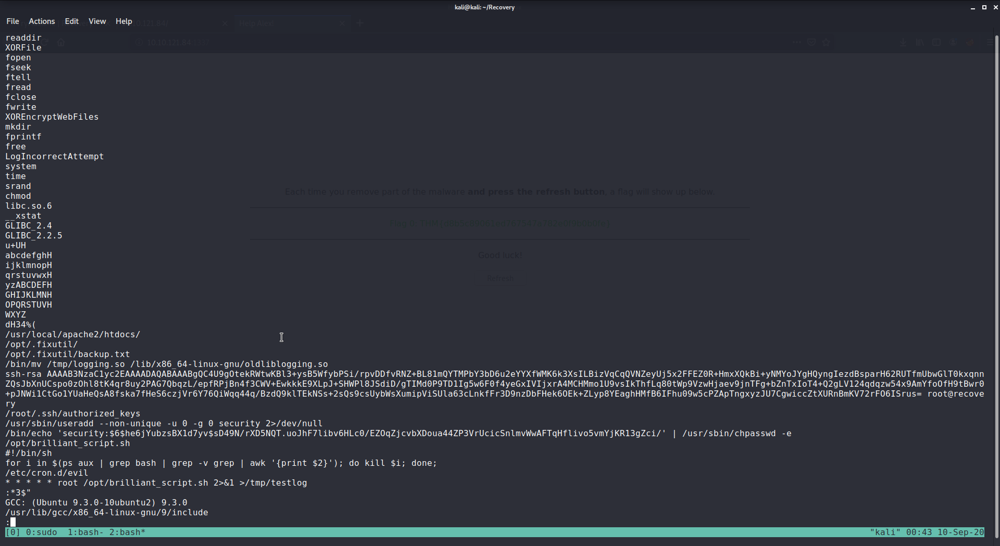

# TryHackMe : Recovery

## Checking out the server

If we go to the web page, we will find that there is some encrypted and garbage results on the webpage :


Also we'll keep the portal on port 1337 open to keep track of our objective. The ssh credentials have been given to us :

```
Username: alex
Password: madeline
```

## Logging into the ssh server

If you ssh into the server with the above credentials, you'll get the following : 


So you cannot work with the ssh at this point of time.

## Recons

Doing normal and complete port scans doesn't give us much. Also, doing a directory brute forcing doesn't give us anything.


Only the port 22 (ssh) and port 80 (for the webserver) are open. 

## Getting code execution through the ssh

We try to execute some code through the ssh login. Let's try downloading the binary, from the directory mentioned by alex.

We can also execute some code using ssh as follows :

```
kali@kali:~/Recovery$ ssh alex@10.10.246.123 'bash -c "whoami"'
The authenticity of host '10.10.246.123 (10.10.246.123)' can't be established.
ECDSA key fingerprint is SHA256:LB52ztZ+SDsYI2coLPSOhEKolWyBQpufnJE/ImwRIgs.
Are you sure you want to continue connecting (yes/no/[fingerprint])? yes
Warning: Permanently added '10.10.246.123' (ECDSA) to the list of known hosts.
alex@10.10.246.123's password: 
alex
```

But it seems you cannot ping yourself and when I tried to use netcat to get a reverse shell.


Now we can finally work here and possibly stop what was happening.

## Finding out the main problem

Now when I tried to check the bashrc, I found out that in there was the message that we were getting when we logged in through ssh. 


It shows that whenever you spawn a bash instance, this message will be displayed in an infinite loop.

There were error opening the .bashrc in some type of text editors. So, I removed the bashrc entirely :)

Now as soone as I remove the bashrc and login through ssh, there is no problem, and I get the first flag.

## Checking the binary

Let's download the binary through, scp and analyse it locally.

If we open the binary in a decompiler (I used Cutter), we can find that there is a main function, which does most of the work. 


It does the following as understandable from the decompilation : 

1) It opens the bashrc and writes the infinite loop which causes the problem when you log in through ssh, that is the displaying of the message.<br>
2) Then it copies the `liblogging.so` file to the tmp folder and writes something into the original file.<br>

So that means,we still have the original file in the tmp directory.

4) Then it runs the binary `admin` by echoing `pwned` into it. 

```
echo pwned | /bin/admin > /dev/null
```

And that's all it does.

## Fixing the liblogging.so

We can copy back the original file to its original place from the tmp directory.

It seems that the binary called `admin` depends on the liblogging.so 

Upon checking the strings in the binary we get a few things : 



1) It overwrites the webfiles using XOR encryption.<br>
2) There is file called fixutil in the opt directory

```
/opt/.fixutil/
/opt/.fixutil/backup.txt
```

3) There is also a backup directory<br>
4) It also seems that the binary creates an user called security with the same user id as the root.<br>

```
/bin/mv /tmp/logging.so /lib/x86_64-linux-gnu/oldliblogging.so
```

This shows that the `libloggin.so` file that it had copied before into the tmp directory, it moves back to the original place with the name `oldliblogging.so`

5) Then it also pushes its ssh keys into the .ssh folder of root directory in order to access it later on.<br>
6) Then it also sets up a cronjob which will run every minute as root.<br>
7) 7 The cronjob runs a script `brilliant_script.sh`


But first we need to bring back the original liblogging.so file

```
alex@recoveryserver:/lib/x86_64-linux-gnu$ cp oldliblogging.so liblogging.so 
```

As soon as we restore the original libloggin.so file, we see that we get our FLAG2


## Trying privilege escalation through the cronjob

When we check out the bash script in the /opt folder : 

```
alex@recoveryserver:/opt$ ls -l
total 4
-rwxrwxrwx 1 root root 95 Jun 17 21:22 brilliant_script.sh
alex@recoveryserver:/opt$ cat brilliant_script.sh 
#!/bin/sh

for i in $(ps aux | grep bash | grep -v grep | awk '{print $2}'); do kill $i; done;
```

We see that first of all it is writable by all. 

Then it kills all the running processes in a loop. So we need to get rid of this, as this most probably keeps closing our ssh session. <br>
Overwrite this with a bash reverse shell.


## Removing the ssh keys and the security user


Now since we have the root user, we can put our own ssh keys in the place of the ones put the binary as well as remove the security user.<br>

But by just logging in as the root user and removing the ssh keys, gives us the flag 1 and flag3.

But for proper usage, lets push our own ssh keys to the root.


Remove this user.

This will give us the flag4

## Decrypting the Webfiles

As we have seen from the string dump of the binary, the web files were encrypted using the XOR encryption. 

Upon checking the .fixutil folder created by fixutil binary, we find that there is a `backup.txt`

```
root@recoveryserver:/opt/.fixutil# ls -al
total 16
drwx------ 2 root root 4096 Jun 17 21:22 .
drwxr-xr-x 1 root root 4096 Jun 17 21:22 ..
-rw-r--r-- 1 root root   16 Jun 17 21:22 backup.txt
root@recoveryserver:/opt/.fixutil# cat backup.txt 
AdsipPewFlfkmll
```

From the strings in the binary, we find that it accesses the files in 

```
/usr/local/apache2/htdocs/
```

Here we that all the files, along with the index.html have been encrypted. In cyberchef, we upload the index.html and set the key as `AdsipPewFlfkmll` to get the actual index.html.

On changing the old index.html with the new one we get the following : 


Before proceeding, change all the files in the same way

Upon decrypting all the web files, you get the 5th and final flag.


