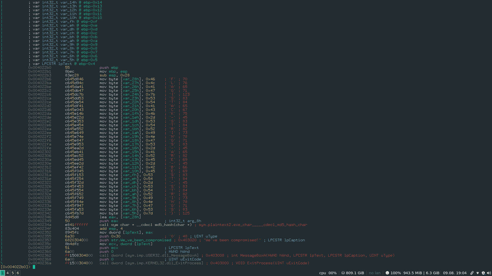

# TryHackMe : Basic Malware Reversing

## Challenge 1

Download the challenge binary and unzip it. Normally trying to unzip it, will result in an error saying unsupported compression type.<br>
Trying to extract using 7z will ask us for password. The password is given as `MalwareTech`

We see that a new file `strings1.exe_` is extracted out.<br>

Running the strings command and piping it to less gives us several strings with tha FLAG :


But the challenge says the binary should print out a md5 hash, so we need to look for a md5 hash<br>

If we load the binary in radare2 and check the entry point of the binary, we will find the flag<br>


```
.FLAG_CAN_I_MAKE_IT_ANYMORE_OBVIOUS
```

This is the string that we get there.

Searching in the binary, we get it in the actual format :

```
FLAG{CAN-I-MAKE-IT-ANYMORE-OBVIOUS}
```


## Challenge 2

This has exactly the same instructions as the previous one. <br>
This one doesn't have any flag strings.<br>


Loading the binary on radare2 and disassembling the entry0 (entry point), we see that the flag is loaded character by character in an array. <br>




```
    ; var LPCSTR lpText @ ebp-0x4
|           0x004022b0      55             push ebp
|           0x004022b1      8bec           mov ebp, esp
|           0x004022b3      83ec28         sub esp, 0x28
|           0x004022b6      c645d846       mov byte [var_28h], 0x46    ; 'F' ; 70
|           0x004022ba      c645d94c       mov byte [var_27h], 0x4c    ; 'L' ; 76
|           0x004022be      c645da41       mov byte [var_26h], 0x41    ; 'A' ; 65
|           0x004022c2      c645db47       mov byte [var_25h], 0x47    ; 'G' ; 71
|           0x004022c6      c645dc7b       mov byte [var_24h], 0x7b    ; '{' ; 123
|           0x004022ca      c645dd53       mov byte [var_23h], 0x53    ; 'S' ; 83
|           0x004022ce      c645de54       mov byte [var_22h], 0x54    ; 'T' ; 84
|           0x004022d2      c645df41       mov byte [var_21h], 0x41    ; 'A' ; 65
|           0x004022d6      c645e043       mov byte [var_20h], 0x43    ; 'C' ; 67
|           0x004022da      c645e14b       mov byte [var_1fh], 0x4b    ; 'K' ; 75
|           0x004022de      c645e22d       mov byte [var_1eh], 0x2d    ; '-' ; 45
|           0x004022e2      c645e353       mov byte [var_1dh], 0x53    ; 'S' ; 83
|           0x004022e6      c645e454       mov byte [var_1ch], 0x54    ; 'T' ; 84
|           0x004022ea      c645e552       mov byte [var_1bh], 0x52    ; 'R' ; 82
|           0x004022ee      c645e649       mov byte [var_1ah], 0x49    ; 'I' ; 73
|           0x004022f2      c645e74e       mov byte [var_19h], 0x4e    ; 'N' ; 78
|           0x004022f6      c645e847       mov byte [var_18h], 0x47    ; 'G' ; 71
|           0x004022fa      c645e953       mov byte [var_17h], 0x53    ; 'S' ; 83
|           0x004022fe      c645ea2d       mov byte [var_16h], 0x2d    ; '-' ; 45
|           0x00402302      c645eb41       mov byte [var_15h], 0x41    ; 'A' ; 65
|           0x00402306      c645ec52       mov byte [var_14h], 0x52    ; 'R' ; 82
|           0x0040230a      c645ed45       mov byte [var_13h], 0x45    ; 'E' ; 69
|           0x0040230e      c645ee2d       mov byte [var_12h], 0x2d    ; '-' ; 45
|           0x00402312      c645ef42       mov byte [var_11h], 0x42    ; 'B' ; 66
|           0x00402316      c645f045       mov byte [var_10h], 0x45    ; 'E' ; 69
|           0x0040231a      c645f153       mov byte [var_fh], 0x53     ; 'S' ; 83
|           0x0040231e      c645f254       mov byte [var_eh], 0x54     ; 'T' ; 84
|           0x00402322      c645f32d       mov byte [var_dh], 0x2d     ; '-' ; 45
|           0x00402326      c645f453       mov byte [var_ch], 0x53     ; 'S' ; 83
|           0x0040232a      c645f554       mov byte [var_bh], 0x54     ; 'T' ; 84
|           0x0040232e      c645f652       mov byte [var_ah], 0x52     ; 'R' ; 82
|           0x00402332      c645f749       mov byte [var_9h], 0x49     ; 'I' ; 73
|           0x00402336      c645f84e       mov byte [var_8h], 0x4e     ; 'N' ; 78
|           0x0040233a      c645f947       mov byte [var_7h], 0x47     ; 'G' ; 71
|           0x0040233e      c645fa53       mov byte [var_6h], 0x53     ; 'S' ; 83
|           0x00402342      c645fb7d       mov byte [var_5h], 0x7d     ; '}' ; 125
|           0x00402346      8d45d8         lea eax, [var_28h]
```

So the flag obtained is : 

```
FLAG{STACK-STRINGS-ARE-BEST-STRINGS}
```


## Challenge 3

This one also has the same instructions, and running strings on this doesn't give us anything much.<br>
If we check the strings in the binary, we will find that there are some strings in flag format in the rscr section, which explains why it wasn't visible in the strings command.<br>


But we still need to find which string is required.<br>
If we look into the `LoadString` function, we will find out that the first parameter is the string identifier. Next is the lpBuffer and the next is the buffer to recive the string.<br>

In ghidra, we can check the rscr section as it displays the string identifiers also along with it. The string identifier, given in the `LoadString` function was `0x110` or 272 in decimanl.<br>


If we check the rscr section for the String ID 272 we will find the flag.


