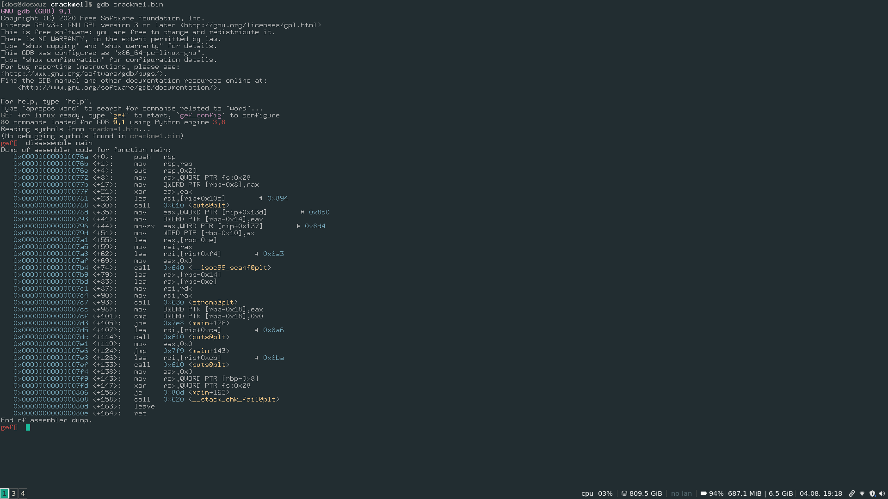
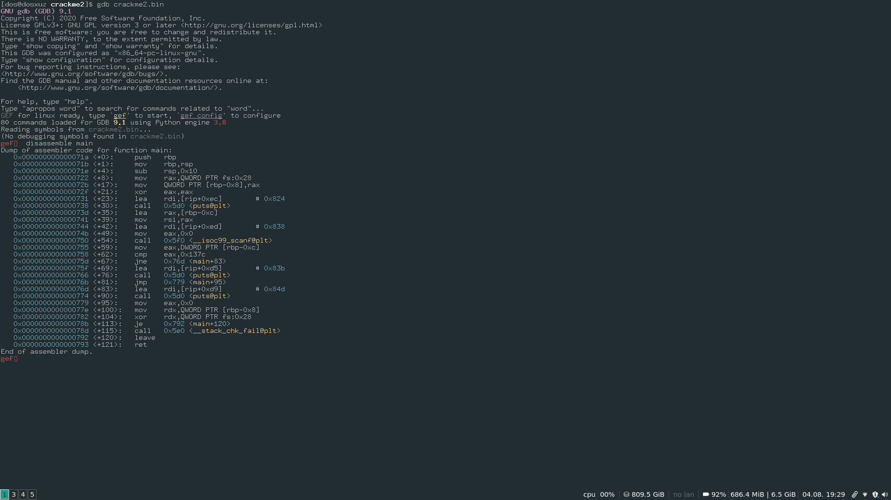
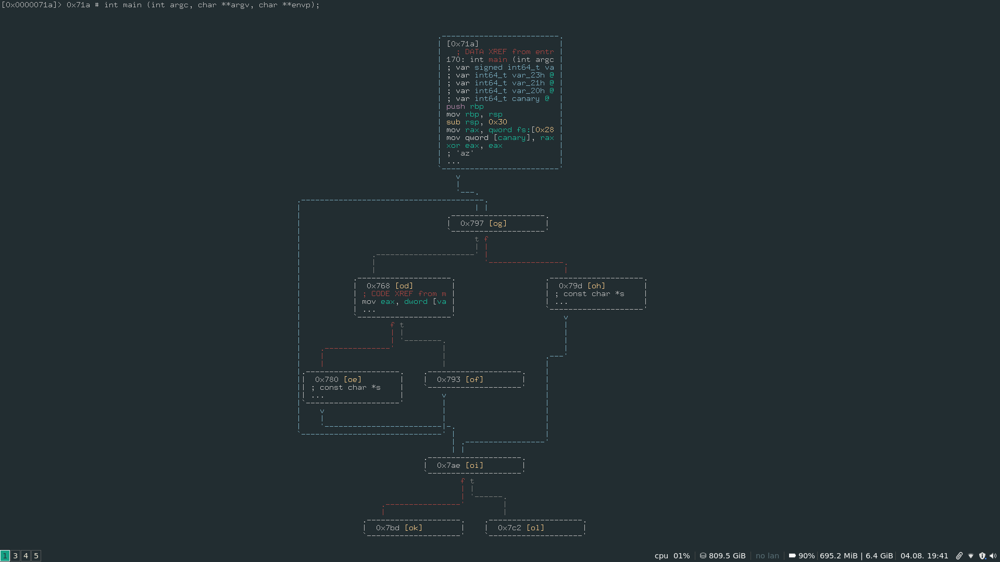

# TryHackMe : Reverse Engineering

## Crackme1

Set permissions and run the binary : 

```
./crackme1.bin 
enter password
aaaaaaa
password is incorrect
*** stack smashing detected ***: terminated
Aborted (core dumped)
```

It seems that there is very small space in the stack

```
 ./crackme1.bin 
enter password
aaaaaa
```

While entering 6 strings, the program seems to be fine. So the max size of the flag can be 6.</br>
Let's open it in gdb and check its working.</br>



In the disassembly we can see that there is a `strcmp` function. We can place a breakpoint before that.</br>

```
$rax   : 0x00007fffffffdfe2  →  0x0300616161616161 ("aaaaaa"?)
$rbx   : 0x0000555555554810  →  <__libc_csu_init+0> push r15
$rcx   : 0x0               
$rdx   : 0x00007fffffffdfdc  →  0x6161007230786168 ("hax0r"?)
$rsp   : 0x00007fffffffdfd0  →  0x0000000000000000
$rbp   : 0x00007fffffffdff0  →  0x0000000000000000
$rsi   : 0x00007fffffffdfdc  →  0x6161007230786168 ("hax0r"?)
$rdi   : 0x00007fffffffdfe2  →  0x0300616161616161 ("aaaaaa"?)
$rip   : 0x00005555555547c7  →  <main+93> call 0x555555554630 <strcmp@plt>
$r8    : 0xffffffffffffff80
$r9    : 0x40              
$r10   : 0x6               
$r11   : 0x246             
$r12   : 0x0000555555554660  →  <_start+0> xor ebp, ebp
$r13   : 0x00007fffffffe0e0  →  0x0000000000000001
$r14   : 0x0               
$r15   : 0x0               
$eflags: [zero carry parity adjust sign trap INTERRUPT direction overflow resume virtualx86 identification]
$cs: 0x0033 $ss: 0x002b $ds: 0x0000 $es: 0x0000 $fs: 0x0000 $gs: 0x0000
```

In the register dump, we can see that the register `rsi` is holding the flag as the parameter and our entered password is in the register `rdi`.</br>

```
./crackme1.bin 
enter password
hax0r
password is correct
```


## Crackme2

Unlike the first one, this one seems to be having a bigger stack space allocated.</br>

```
 ./crackme2.bin 
enter your password
aaaaaaaaaaaaaaaaaa
password is incorrect
```

Lets run it in gdb </br>



In the main function, we can see that there is a `cmp` statement which compares it to the value `0x137c`.</br>
If they are not equal, then it jumps to a puts statement, which in turn returns the incorrect message</br>

Now if we enter this value then it is check for correct.</br>

```
gef➤  r
Starting program: /home/dos/tryhackme/reverse_engineering/crackme2/crackme2.bin 
enter your password
4988
password is valid
[Inferior 1 (process 4070) exited normally]
gef➤  
```

Here, we have to enter the decimal value of `0x137c` that is 4988.


## Crackme3

```
gef➤  disassemble main
Dump of assembler code for function main:
   0x000000000000071a <+0>:	push   rbp
   0x000000000000071b <+1>:	mov    rbp,rsp
   0x000000000000071e <+4>:	sub    rsp,0x30
   0x0000000000000722 <+8>:	mov    rax,QWORD PTR fs:0x28
   0x000000000000072b <+17>:	mov    QWORD PTR [rbp-0x8],rax
   0x000000000000072f <+21>:	xor    eax,eax
   0x0000000000000731 <+23>:	mov    WORD PTR [rbp-0x23],0x7a61
   0x0000000000000737 <+29>:	mov    BYTE PTR [rbp-0x21],0x74
   0x000000000000073b <+33>:	lea    rdi,[rip+0x112]        # 0x854
   0x0000000000000742 <+40>:	call   0x5d0 <puts@plt>
   0x0000000000000747 <+45>:	lea    rax,[rbp-0x20]
   0x000000000000074b <+49>:	mov    rsi,rax
   0x000000000000074e <+52>:	lea    rdi,[rip+0x113]        # 0x868
   0x0000000000000755 <+59>:	mov    eax,0x0
   0x000000000000075a <+64>:	call   0x5f0 <__isoc99_scanf@plt>
   0x000000000000075f <+69>:	mov    DWORD PTR [rbp-0x28],0x0
   0x0000000000000766 <+76>:	jmp    0x797 <main+125>
   0x0000000000000768 <+78>:	mov    eax,DWORD PTR [rbp-0x28]
   0x000000000000076b <+81>:	cdqe   
   0x000000000000076d <+83>:	movzx  edx,BYTE PTR [rbp+rax*1-0x20]
   0x0000000000000772 <+88>:	mov    eax,DWORD PTR [rbp-0x28]
   0x0000000000000775 <+91>:	cdqe   
   0x0000000000000777 <+93>:	movzx  eax,BYTE PTR [rbp+rax*1-0x23]
   0x000000000000077c <+98>:	cmp    dl,al
   0x000000000000077e <+100>:	je     0x793 <main+121>
   0x0000000000000780 <+102>:	lea    rdi,[rip+0xe4]        # 0x86b
   0x0000000000000787 <+109>:	call   0x5d0 <puts@plt>
   0x000000000000078c <+114>:	mov    eax,0x0
   0x0000000000000791 <+119>:	jmp    0x7ae <main+148>
   0x0000000000000793 <+121>:	add    DWORD PTR [rbp-0x28],0x1
   0x0000000000000797 <+125>:	cmp    DWORD PTR [rbp-0x28],0x2
   0x000000000000079b <+129>:	jle    0x768 <main+78>
   0x000000000000079d <+131>:	lea    rdi,[rip+0xdd]        # 0x881
   0x00000000000007a4 <+138>:	call   0x5d0 <puts@plt>
   0x00000000000007a9 <+143>:	mov    eax,0x0
   0x00000000000007ae <+148>:	mov    rcx,QWORD PTR [rbp-0x8]
   0x00000000000007b2 <+152>:	xor    rcx,QWORD PTR fs:0x28
   0x00000000000007bb <+161>:	je     0x7c2 <main+168>
   0x00000000000007bd <+163>:	call   0x5e0 <__stack_chk_fail@plt>
   0x00000000000007c2 <+168>:	leave  
   0x00000000000007c3 <+169>:	ret    
End of assembler dump.
```

The disassmebly of the main function is difficult to understand because of the present of loops</br>
So, to make it easier for us to read, we will use radare2, which has the graph view.</br>

```
[0x00000610]> aaa
[x] Analyze all flags starting with sym. and entry0 (aa)
[x] Analyze function calls (aac)
[x] Analyze len bytes of instructions for references (aar)
[x] Check for objc references
[x] Check for vtables
[x] Type matching analysis for all functions (aaft)
[x] Propagate noreturn information
[x] Use -AA or aaaa to perform additional experimental analysis.
[0x00000610]> afl
0x00000610    1 42           entry0
0x00000640    4 50   -> 40   sym.deregister_tm_clones
0x00000680    4 66   -> 57   sym.register_tm_clones
0x000006d0    5 58   -> 51   sym.__do_global_dtors_aux
0x00000710    1 10           entry.init0
0x00000840    1 2            sym.__libc_csu_fini
0x00000844    1 9            sym._fini
0x000007d0    4 101          sym.__libc_csu_init
0x0000071a    9 170          main
0x000005a0    3 23           sym._init
0x000005d0    1 6            sym.imp.puts
0x000005e0    1 6            sym.imp.__stack_chk_fail
0x00000000    2 25           loc.imp._ITM_deregisterTMCloneTable
0x000005f0    1 6            sym.imp.__isoc99_scanf
[0x00000610]> 
```

There is the main function.

Type :

```
s main
pdf
VV
```

This will give the grap view.</br>



The above is a very shortened graph view of the main function</br>
You can use `Ctrl++` or `Ctrl+-` to zoom in or out and use vim keys for navigation</br>


From the disassembly, few things are clear : </br>
1) At the beginning the variable `var_28h` is set to zero, it appears to be acting as a counter for the program</br>
2) Then it is compared to 2. If it is equal to 2, it jumps to the correct statement else goes to the next iteration</br>
3) If the equality is not satisfied, then few operations are carried out and the registers `dl` and `al` are compared</br>

```
mov eax, dword [var_28h]                                                                         
movzx edx, byte [rbp + rax - 0x20]                                                               
mov eax, dword [var_28h]                                                                         
cdqe                                                                                             
movzx eax, byte [rbp + rax - 0x23]                                                               
cmp dl, al                                                                                       
je 0x793 
```
4) Now here if this condition is not satisfied, then it moves to incorrect password</br>
Else, the vaeiable is increased by one and goes for the next iteration</br>


Things to be done in this case : </br>

1) Enter a 3 character value</br>
2)  Set a break point where the two registers `dl` and `al` are compared. </br>
3) For each iteration, take note of their values which cause the condition check to fail</br>
4) Change the values of the registers accordingly, such that the condition never fails.</br>

But before that you have to load radare2 in debug mode :</br>

```
r2 -d crackme3.bin
```

```
:> db 0x5594eef5877c
:> dc
enter your password
aaa
hit breakpoint at: 5594eef5877c
:> dr
rax = 0x00000061
rbx = 0x5594eef587d0
rcx = 0x00000000
rdx = 0x00000061
r8 = 0xffffffffffffff80
r9 = 0x00000040
r10 = 0x00000003
r11 = 0x00000246
r12 = 0x5594eef58610
r13 = 0x7ffff0a8ebd0
r14 = 0x00000000
r15 = 0x00000000
rsi = 0x0000000a
rdi = 0x7ffff0a8e570
rsp = 0x7ffff0a8eab0
rbp = 0x7ffff0a8eae0
rip = 0x5594eef5877c
rflags = 0x00000293
orax = 0xffffffffffffffff
:> dr dl
0x00000061
:> dr dl
0x00000061
```

Here on the first iteration, we see that the value of both the registers are same.</br>
Therefore, it must run one more time.</br>

```
:> dc
hit breakpoint at: 5594eef5877c
:> dr dl
0x00000061
:> dr al
0x0000007a
```

After it hits the break point again, we see that the value for al is `0x7a` or `z`.</br>
Now, we need to change the value of `dl` to `0x7a` so that the execution doesn't stop.</br>

```
:> dr dl=0x7a
0x00000061 ->0x0000007a
```

It will again hit the same break point</br>

```
:> dr dl
0x00000061
:> dr al
0x00000074
```
Now the value of `al` is `0x74` or `t`</br>
Change the value of `dl` accordingly, if you want to continue the execution (Although at this point, we have got the password)</br>

```
:> dr dl=0x74
0x00000061 ->0x00000074
:> dcr
password is correct
hit breakpoint at: 55dfb88157a9
:> 
```

So, we can be sure that the password is correct.</br>

```
./crackme3.bin 
enter your password
azt
password is correct
```


