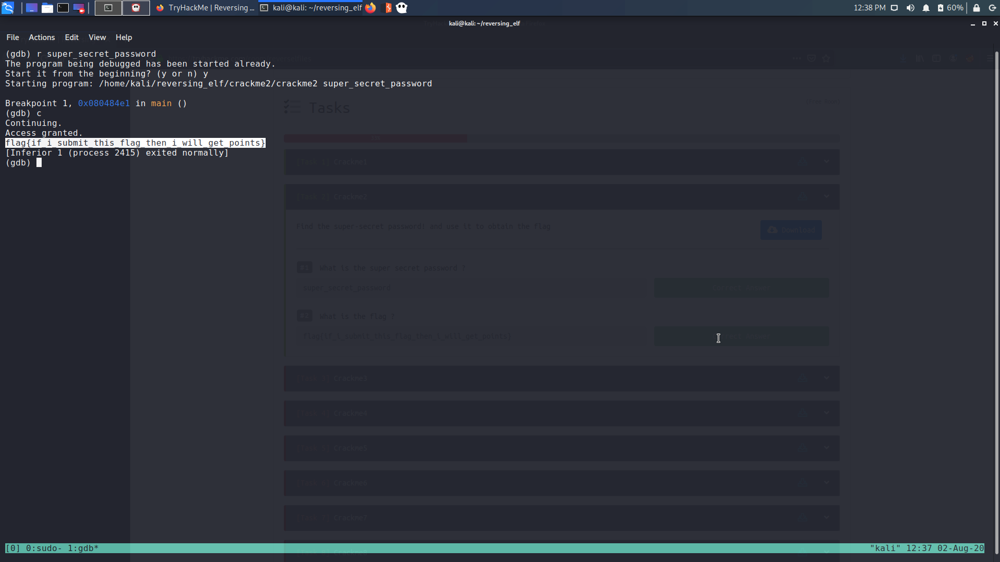
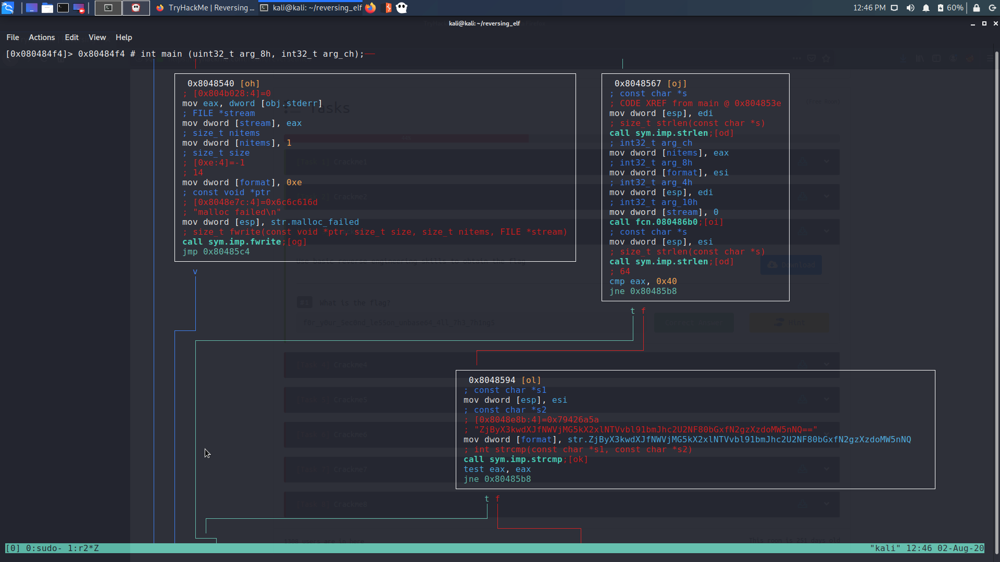
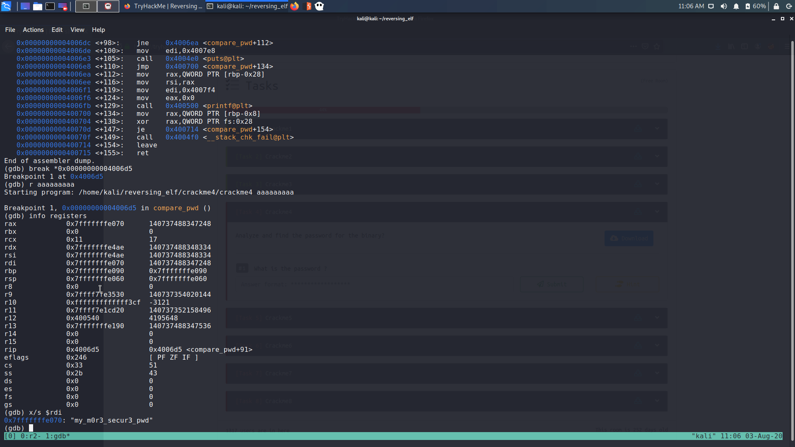

# TryHackMe : Reversing ELF

## Crackme 2

Make the binary executable and run it :

```
kali@kali:~/reversing_elf/crackme2$ ./crackme2 
Usage: ./crackme2 password
```

Need password as the parameter.</br>

```
kali@kali:~/reversing_elf/crackme2$ file crackme2
crackme2: ELF 32-bit LSB executable, Intel 80386, version 1 (SYSV), dynamically linked, interpreter /lib/ld-linux.so.2, for GNU/Linux 2.6.32, BuildID[sha1]=b799eb348f3df15f6b08b3c37f8feb269a60aba7, not stripped
```

This says that the binary is not stripped.</br>

```
kali@kali:~/reversing_elf/crackme2$ ./crackme2 klaksjdlaksdjl
Access denied.
```

Running with random passwords gives access denied.

```
(gdb) info functions
All defined functions:

Non-debugging symbols:
0x08048304  _init
0x08048340  strcmp@plt
0x08048350  printf@plt
0x08048360  puts@plt
0x08048370  __libc_start_main@plt
0x08048380  memset@plt
0x08048390  __gmon_start__@plt
0x080483a0  _start
0x080483d0  __x86.get_pc_thunk.bx
0x080483e0  deregister_tm_clones
0x08048410  register_tm_clones
0x08048450  __do_global_dtors_aux
0x08048470  frame_dummy
0x0804849b  main
0x08048526  giveFlag
0x080485c0  __libc_csu_init
0x08048620  __libc_csu_fini
0x08048624  _fini
(gdb) 
```
There is a main function and a giveFlag function.</br>

```
(gdb) disassemble main
Dump of assembler code for function main:
   0x0804849b <+0>:     lea    ecx,[esp+0x4]
   0x0804849f <+4>:     and    esp,0xfffffff0
   0x080484a2 <+7>:     push   DWORD PTR [ecx-0x4]
   0x080484a5 <+10>:    push   ebp
   0x080484a6 <+11>:    mov    ebp,esp
   0x080484a8 <+13>:    push   ecx
   0x080484a9 <+14>:    sub    esp,0x4
   0x080484ac <+17>:    mov    eax,ecx
   0x080484ae <+19>:    cmp    DWORD PTR [eax],0x2
   0x080484b1 <+22>:    je     0x80484d0 <main+53>
   0x080484b3 <+24>:    mov    eax,DWORD PTR [eax+0x4]
   0x080484b6 <+27>:    mov    eax,DWORD PTR [eax]
   0x080484b8 <+29>:    sub    esp,0x8
   0x080484bb <+32>:    push   eax
   0x080484bc <+33>:    push   0x8048660
   0x080484c1 <+38>:    call   0x8048350 <printf@plt>
   0x080484c6 <+43>:    add    esp,0x10
   0x080484c9 <+46>:    mov    eax,0x1
   0x080484ce <+51>:    jmp    0x804851e <main+131>
   0x080484d0 <+53>:    mov    eax,DWORD PTR [eax+0x4]
   0x080484d3 <+56>:    add    eax,0x4
   0x080484d6 <+59>:    mov    eax,DWORD PTR [eax]
   0x080484d8 <+61>:    sub    esp,0x8
   0x080484db <+64>:    push   0x8048674
   0x080484e0 <+69>:    push   eax
   0x080484e1 <+70>:    call   0x8048340 <strcmp@plt>
   0x080484e6 <+75>:    add    esp,0x10
   0x080484e9 <+78>:    test   eax,eax
   0x080484eb <+80>:    je     0x8048504 <main+105>
   0x080484ed <+82>:    sub    esp,0xc
   0x080484f0 <+85>:    push   0x804868a
   0x080484f5 <+90>:    call   0x8048360 <puts@plt>
   0x080484fa <+95>:    add    esp,0x10
   0x080484fd <+98>:    mov    eax,0x1
   0x08048502 <+103>:   jmp    0x804851e <main+131>
   0x08048504 <+105>:   sub    esp,0xc
   0x08048507 <+108>:   push   0x8048699
   0x0804850c <+113>:   call   0x8048360 <puts@plt>
   0x08048511 <+118>:   add    esp,0x10
   0x08048514 <+121>:   call   0x8048526 <giveFlag>
   0x08048519 <+126>:   mov    eax,0x0
   0x0804851e <+131>:   mov    ecx,DWORD PTR [ebp-0x4]
   0x08048521 <+134>:   leave  
   0x08048522 <+135>:   lea    esp,[ecx-0x4]
   0x08048525 <+138>:   ret    
```

This is the disassembly of the main function. There is a strcmp in line 70. </br>
Put a breakpoint there and run the program with a bunch of a's :  

```
(gdb) break *0x080484e1
Breakpoint 1 at 0x80484e1
(gdb) r aaaaaa
Starting program: /home/kali/reversing_elf/crackme2/crackme2 aaaaaa

Breakpoint 1, 0x080484e1 in main ()
```

```
(gdb) info registers
eax            0xffffd4b1          -11087
ecx            0xffffd260          -11680
edx            0xffffd284          -11644
ebx            0x0                 0
esp            0xffffd230          0xffffd230
ebp            0xffffd248          0xffffd248
esi            0xf7fb5000          -134524928
edi            0xf7fb5000          -134524928
eip            0x80484e1           0x80484e1 <main+70>
eflags         0x292               [ AF SF IF ]
cs             0x23                35
ss             0x2b                43
ds             0x2b                43
es             0x2b                43
fs             0x0                 0
gs             0x63                99
```

```
(gdb) x/s 0xffffd4b1
0xffffd4b1:     "aaaaaa"
```

This shows that the register eax contains our string. But just before eax is passed, there is an address given there.

```
(gdb) x/s 0x8048674
0x8048674:      "super_secret_password"
```

This gives us the password.</br>
Upon running the program with the password we get the flag.</br>



There is a function called the `giveFlag` function, which gives the flag.


## Crackme 3

Since this binary is stripped, and we cannot get to a particular function directly, open it in radare2. </br>



In the main function determined by radare2, you can see that after the initial check, there is a base64 encoded string. That is the flag</br>
If we base64 decode it, we get the actual flag.

```
f0r_y0ur_5ec0nd_le55on_unbase64_4ll_7h3_7h1ng5
```

```
kali@kali:~/reversing_elf$ echo ZjByX3kwdXJfNWVjMG5kX2xlNTVvbl91bmJhc2U2NF80bGxfN2gzXzdoMW5nNQ== |  base64 -d
f0r_y0ur_5ec0nd_le55on_unbase64_4ll_7h3_7h1ng5
```

## Crackme 4

Running file command on the binary gives us that it is not stripped, so we can get the function symbols.</br>

```
(gdb) info functions                                                                                                                                                                        
All defined functions:                                                                                                                                                                      
                                                                                                                                                                                            
Non-debugging symbols:                                                                                                                                                                      
0x00000000004004b0  _init                                                                                                                                                                   
0x00000000004004e0  puts@plt                                                                                                                                                                
0x00000000004004f0  __stack_chk_fail@plt                                                                                                                                                    
0x0000000000400500  printf@plt                                                                                                                                                              
0x0000000000400510  __libc_start_main@plt                                                                                                                                                   
0x0000000000400520  strcmp@plt                                                                                                                                                              
0x0000000000400530  __gmon_start__@plt                                                                                                                                                      
0x0000000000400540  _start                                                                                                                                                                  
0x0000000000400570  deregister_tm_clones                                                                                                                                                    
0x00000000004005a0  register_tm_clones                                                                                                                                                      
0x00000000004005e0  __do_global_dtors_aux                                                                                                                                                   
0x0000000000400600  frame_dummy                                                                                                                                                             
0x000000000040062d  get_pwd                                                                                                                                                                 
0x000000000040067a  compare_pwd                                                                                                                                                             
0x0000000000400716  main                                                                                                                                                                    
0x0000000000400760  __libc_csu_init                                                                                                                                                         
0x00000000004007d0  __libc_csu_fini                                                                                                                                                         
0x00000000004007d4  _fini             
```

1) There is a main function</br>
2) There is a compare_pwd function, where the password is possibly checked</br>
3) There is a get_pwd function which takes the password from the argument</br>
4) We see that there is a strcmp and the parameters for the function are passed through the registers $rdi and $rsi.</br>
5) Printing out those registers, gives us the password</br>



The password is `my_m0r3_secur3_pwd`


## Crackme 5

This one is not stripped either</br>
If we open the file in radare2, we see that there is a fucntion `check`</br>
But the main checking seems to be done in the main function only</br>

```
│           0x00400801      bf54094000     mov edi, str.Enter_your_input: ; 0x400954 ; "Enter your input:" ; const char *s
│           0x00400806      e865fdffff     call sym.imp.puts           ; int puts(const char *s)
│           0x0040080b      488d45b0       lea rax, qword [s1]
│           0x0040080f      4889c6         mov rsi, rax
│           0x00400812      bf66094000     mov edi, 0x400966           ; const char *format
│           0x00400817      b800000000     mov eax, 0
│           0x0040081c      e89ffdffff     call sym.imp.__isoc99_scanf ; int scanf(const char *format)
│           0x00400821      488d55d0       lea rdx, qword [s2]
│           0x00400825      488d45b0       lea rax, qword [s1]
│           0x00400829      4889d6         mov rsi, rdx                ; const char *s2
│           0x0040082c      4889c7         mov rdi, rax                ; const char *s1
│           0x0040082f      e8a2feffff     call sym.strcmp             ; int strcmp(const char *s1, const char *s2)
│           0x00400834      8945ac         mov dword [var_54h], eax
│           0x00400837      837dac00       cmp dword [var_54h], 0
│       ┌─< 0x0040083b      750c           jne 0x400849
│       │   0x0040083d      bf69094000     mov edi, str.Good_game      ; 0x400969 ; "Good game" ; const char *s
│       │   0x00400842      e829fdffff     call sym.imp.puts           ; int puts(const char *s)
│      ┌──< 0x00400847      eb0a           jmp 0x400853
│      ││   ; CODE XREF from main @ 0x40083b
│      │└─> 0x00400849      bf73094000     mov edi, str.Always_dig_deeper ; 0x400973 ; "Always dig deeper" ; const char *s
│      │    0x0040084e      e81dfdffff     call sym.imp.puts           ; int puts(const char *s)
│      │    ; CODE XREF from main @ 0x400847
│      └──> 0x00400853      b800000000     mov eax, 0
│           0x00400858      488b4df8       mov rcx, qword [canary]
│           0x0040085c      6448330c2528.  xor rcx, qword fs:[0x28]
│       ┌─< 0x00400865      7405           je 0x40086c
│       │   0x00400867      e824fdffff     call sym.imp.__stack_chk_fail ; void __stack_chk_fail(void)
│       │   ; CODE XREF from main @ 0x400865
│       └─> 0x0040086c      c9             leave
└           0x0040086d      c3             ret
```

We can use the same trick as the previous one to set a break point and then dump the strings in the registers `rsi` and `rdi` :

```
(gdb) break *0x000000000040082f
Breakpoint 1 at 0x40082f
(gdb) r
Starting program: /home/kali/reversing_elf/crackme5/crackme5 
Enter your input:
aaaaaaaaa

Breakpoint 1, 0x000000000040082f in main ()
(gdb) x/s $rdi
0x7fffffffe060: "aaaaaaaaa"
(gdb) x/s $rsi
0x7fffffffe080: "OfdlDSA|3tXb32~X3tX@sX`4tXtz"
(gdb) 
```


## Crackme 6

```
kali@kali:~/reversing_elf/crackme6$ ./crackme6 aaaaaaaa
password "aaaaaaaa" not OK
```


We see that the main function calls a function called `compare_pwd` which checks the password</br>


This shows that this function calls another function called `my_secure_test`</br>

If we check the decompilation of this function, we can make out the password that is checked character by character on each step</br>


```
1337_pwd
```


## Crackme 7

In the decompilation of the main function, we see that there is a check for the variable var_10h which on success calls the `giveFlag` function, which in turn generates the flag</br>


`0x7a69`

But we don't need to go for the check, and can directly change our `ip` to the `giveFlag` function</br>


1) Set a breakpoint on any part in the main function</br>
2) Then as soon as the program counter hits the breakpoint, set the eip to the address of the `giveFlag` function</br>


## Crackme 8

In the decompilation of the main function, we see that like the previous one, it checks the input for a value, and then goes to the `giveFlag` function</br>


This time we will try using gdb</br>

```
(gdb) info functions
All defined functions:

Non-debugging symbols:
0x08048300  _init
0x08048340  printf@plt
0x08048350  puts@plt
0x08048360  __libc_start_main@plt
0x08048370  memset@plt
0x08048380  atoi@plt
0x08048390  __gmon_start__@plt
0x080483a0  _start
0x080483d0  __x86.get_pc_thunk.bx
0x080483e0  deregister_tm_clones
0x08048410  register_tm_clones
0x08048450  __do_global_dtors_aux
0x08048470  frame_dummy
0x0804849b  main
0x08048524  giveFlag
0x080485c0  __libc_csu_init
0x08048620  __libc_csu_fini
0x08048624  _fini
```

We can see the giveFlag function</br>

Place a break point at this compare function : `0x080484e4 <+73>:    cmp    eax,0xcafef00d`

Change the value of eax to the value `0xcafef00d`, so that when the compare is done, it results in truth condition.<br>

```
(gdb) set $eax=0xcafef00d
(gdb) info registers
eax            0xcafef00d          -889262067
ecx            0x0                 0
edx            0xa                 10
ebx            0x0                 0
esp            0xffffd240          0xffffd240
ebp            0xffffd248          0xffffd248
esi            0xf7fb5000          -134524928
edi            0xf7fb5000          -134524928
eip            0x80484e4           0x80484e4 <main+73>
eflags         0x282               [ SF IF ]
cs             0x23                35
ss             0x2b                43
ds             0x2b                43
es             0x2b                43
fs             0x0                 0
gs             0x63                99
(gdb) si
0x080484e9 in main ()
(gdb) c
Continuing.
Access granted.
flag{at_least_this_cafe_wont_leak_your_credit_card_numbers}
[Inferior 1 (process 2908) exited normally]
(gdb) 
```

This shows that the flag is given out.